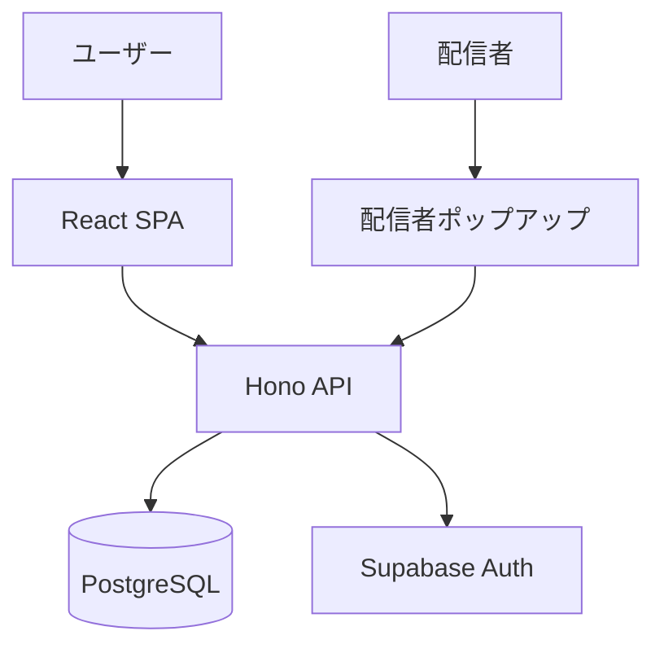

# Duel Log App

**遊戯王マスターデュエルの対戦履歴を記録・分析するWebアプリケーション**

[](https://www.typescriptlang.org/)
[](https://react.dev/)
[](https://hono.dev/)
[](https://opensource.org/licenses/MIT)

---

## 概要

遊戯王マスターデュエルの対戦履歴を記録・管理し、統計情報を分析するためのWebアプリケーション。

### Core Value

| 価値 | 説明 |
|------|------|
| 対戦履歴の可視化 | 勝敗、デッキ、対戦相手を統計情報として可視化 |
| デッキ分析 | デッキごとの勝率、相性表、トレンド分析 |
| 配信者サポート | 配信者ポップアップ、配信者モード（プライバシー保護） |
| データポータビリティ | CSVインポート/エクスポート、統計情報共有URL |

---

## アーキテクチャ



| カテゴリ | 技術 |
|---------|------|
| フロントエンド | React 19 / TypeScript / shadcn/ui / TanStack Router / TanStack Query / Zustand |
| バックエンド | Hono / TypeScript / Drizzle ORM / Zod |
| インフラ | Vercel Functions / Supabase (Auth + PostgreSQL) |
| テスト | Vitest / Testing Library / Playwright |
| モノレポ | pnpm workspaces |

詳細: [アーキテクチャ](./docs/02-architecture/)

---

## プロジェクト構成

```
duel-log-app/
├── apps/
│   └── web/                    # React SPA (Vite)
├── packages/
│   ├── api/                    # Hono API (Vercel Functions)
│   └── shared/                 # Zod schemas + 共通型
├── supabase/                   # Supabase設定・マイグレーション
├── docs/                       # ドキュメント
├── scripts/                    # ユーティリティスクリプト
├── pnpm-workspace.yaml
├── biome.json                  # Linter/Formatter
└── vercel.json                 # デプロイ設定
```

---

## クイックスタート

### 必要条件

- Node.js >= 20
- pnpm >= 10
- Supabase CLI

### セットアップ

```bash
# 依存関係インストール
pnpm install

# ローカルSupabase起動
npx supabase start

# 開発サーバー起動
pnpm dev
```

### アクセス

- アプリ: http://localhost:5173
- Supabase Studio: http://127.0.0.1:54323

---

## コマンド

```bash
# 開発
pnpm dev           # 開発サーバー起動
pnpm build         # ビルド
pnpm test          # テスト実行
pnpm lint          # リント (Biome)
pnpm typecheck     # 型チェック

# データベース
npx supabase start      # ローカルSupabase起動
npx supabase stop       # 停止
npx supabase db reset   # DBリセット（マイグレーション再適用）
```

---

## テストユーザー

シードデータで作成（パスワード: `password123`）:

| ユーザー | メール | 管理者 | デバッガー |
|---------|--------|:------:|:---------:|
| testuser | test@example.com | ✅ | ✅ |
| admin | admin@example.com | ✅ | - |
| debugger | debugger@example.com | - | ✅ |

---

## デプロイ

| 環境 | サービス |
|------|---------|
| フロントエンド + API | Vercel (単一ドメイン) |
| データベース + 認証 | Supabase Cloud |
| CI/CD | GitHub Actions |

詳細: [デプロイ手順](./docs/06-deployment/vercel.md)

---

## ドキュメント

[ドキュメントトップページ](./docs/00-index.md)

| 対象 | ドキュメント |
|------|------------|
| 初めての方 | [概要](./docs/01-overview/summary.md), [アーキテクチャ](./docs/02-architecture/) |
| 開発者 | [クイックスタート](./docs/05-guides/quickstart.md), [データモデル](./docs/03-details/data-model.md) |
| 運用者 | [デプロイ](./docs/06-deployment/), [CI/CD](./docs/06-deployment/ci-cd.md) |

---

## ライセンス

[MIT License](./LICENSE)
