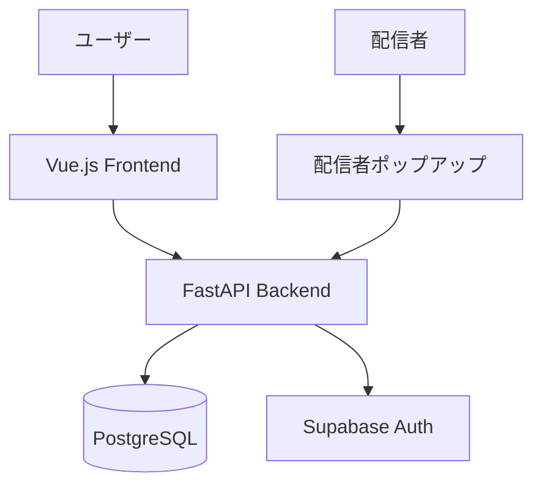

# Duel Log App

**遊戯王マスターデュエルの対戦履歴を記録・分析するWebアプリケーション**

[](https://opensource.org/licenses/MIT)
[](https://www.python.org/)
[](https://vuejs.org/)

---

## 概要

遊戯王マスターデュエルの対戦履歴を記録・管理し、統計情報を分析するためのWebアプリケーション。

### Core Value

| 価値 | 説明 |
|------|------|
| 対戦履歴の可視化 | 勝敗、デッキ、対戦相手を統計情報として可視化 |
| デッキ分析 | デッキごとの勝率、相性表、トレンド分析 |
| 配信者サポート | 配信者ポップアップ、配信者モード（プライバシー保護） |
| データポータビリティ | CSVインポート/エクスポート、統計情報共有URL |

---

## アーキテクチャ



| レイヤー | 技術 |
|----------|------|
| フロントエンド | Vue 3 / TypeScript / Vuetify 3 / Pinia |
| バックエンド | Python 3.11+ / FastAPI / SQLAlchemy 2.0 |
| データベース | PostgreSQL (Supabase) |
| 認証 | Supabase Auth (OAuth対応) |

詳細: [アーキテクチャ](./docs/02-architecture/)

---

## インストール（Docker）

### 必要条件

- Docker Desktop

### 起動

```bash
# プロジェクト起動
cd ~/work/projects/duel-log-app
docker compose up -d
```

### アクセス

- フロントエンド: http://localhost:5173
- バックエンドAPI: http://localhost:8000

### コマンド

```bash
# 起動
docker compose up -d

# ログ確認
docker compose logs -f backend
docker compose logs -f frontend

# 停止
docker compose down
```

---

## 配信者サポート

**配信者ポップアップ** - OBS連携なしで、ウィンドウキャプチャで統計表示。

詳細: [配信者ポップアップ](./docs/05-features/streamer-popup-design.md)

---

## 開発

```bash
# テスト（Docker環境）
docker compose exec backend python -m pytest
docker compose exec frontend npm run test:unit
```

詳細: [開発環境セットアップ](./docs/08-development/environment-setup.md)

---

## デプロイ

| 環境 | サービス |
|------|----------|
| フロントエンド | Vercel |
| バックエンド | Render (Docker) |
| データベース | Supabase Cloud |
| CI/CD | GitHub Actions |

詳細: [デプロイ手順](./docs/07-deployment/deployment.md)

---

## ドキュメント

📚 **[ドキュメントトップページ](./docs/00-INDEX.md)**

| 対象 | ドキュメント |
|------|------------|
| 初めての方 | [概要](./docs/01-introduction/overview.md), [アーキテクチャ](./docs/02-architecture/) |
| 利用者 | [機能一覧](./docs/05-features/), [配信者ポップアップ](./docs/05-features/streamer-popup-design.md) |
| 開発者 | [開発ガイド](./docs/08-development/), [データモデル](./docs/04-data/) |
| 運用者 | [デプロイ](./docs/07-deployment/), [引き継ぎガイド](./docs/operations/handover-guide.md) |

---

## ライセンス

[MIT License](./LICENSE)
