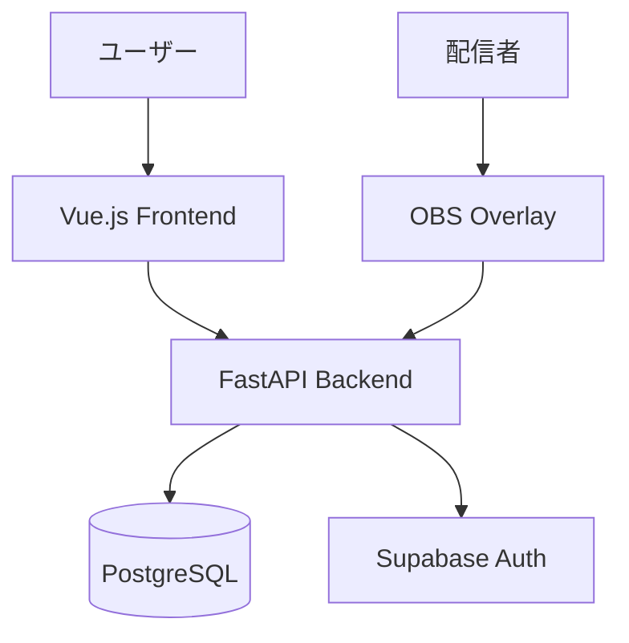

# Duel Log App

**TCG対戦履歴を記録・分析するWebアプリケーション**

[](https://opensource.org/licenses/MIT)
[](https://www.python.org/)
[](https://vuejs.org/)

---

## 概要

トレーディングカードゲーム（TCG）の対戦履歴を記録・管理し、統計情報を分析するためのWebアプリケーション。

### Core Value

| 価値 | 説明 |
|------|------|
| 対戦履歴の可視化 | 勝敗、デッキ、対戦相手を統計情報として可視化 |
| デッキ分析 | デッキごとの勝率、相性表、トレンド分析 |
| 配信者サポート | OBSオーバーレイ、配信者モード（プライバシー保護） |
| データポータビリティ | CSVインポート/エクスポート、統計情報共有URL |

---

## アーキテクチャ



| レイヤー | 技術 |
|----------|------|
| フロントエンド | Vue 3 / TypeScript / Vuetify 3 / Pinia |
| バックエンド | Python 3.11+ / FastAPI / SQLAlchemy 2.0 |
| データベース | PostgreSQL (Supabase) |
| 認証 | Supabase Auth (OAuth対応) |

詳細: [アーキテクチャ](./docs/02-architecture/architecture.md)

---

## インストール

```bash
git clone https://github.com/krtw00/duel-log-app.git
cd duel-log-app
./scripts/dev.sh
```

| 環境 | 要件 |
|------|------|
| Docker Desktop | Supabase CLI用 |
| Node.js | v18以上 |
| Python | 3.11以上 |

---

## 使用方法

### 開発サーバー

```bash
./scripts/dev.sh       # 全サービス起動
./scripts/dev-stop.sh  # 停止
```

| サービス | URL |
|---------|-----|
| フロントエンド | http://localhost:5173 |
| バックエンドAPI | http://127.0.0.1:8000 |
| Supabase Studio | http://127.0.0.1:55323 |

### OBSオーバーレイ

```
https://your-domain.com/obs-overlay?token=[トークン]
```

プロファイルページからトークンを取得し、OBSのブラウザソースに設定。

詳細: [OBSオーバーレイ](./docs/05-features/obs-overlay.md)

---

## 開発

```bash
# バックエンド
cd backend && uv run pytest

# フロントエンド
cd frontend && npm run test:unit
```

| コマンド | 説明 |
|---------|------|
| `uv run pytest` | バックエンドテスト |
| `npm run test:unit` | フロントエンドテスト |
| `uv run ruff check .` | リント |

---

## デプロイ

| 環境 | サービス |
|------|----------|
| フロントエンド | Vercel |
| バックエンド | Render (Docker) |
| データベース | Supabase Cloud |
| CI/CD | GitHub Actions |

詳細: [デプロイ手順](./docs/07-deployment/deployment.md)

---

## ドキュメント

📚 **[ドキュメントトップページ](./docs/00-INDEX.md)**

| 対象 | ドキュメント |
|------|------------|
| 初めての方 | [概要](./docs/01-introduction/overview.md), [アーキテクチャ](./docs/02-architecture/architecture.md) |
| 利用者 | [機能一覧](./docs/05-features/), [OBSオーバーレイ](./docs/05-features/obs-overlay.md) |
| 開発者 | [開発ガイド](./docs/08-development/), [データモデル](./docs/04-data/) |
| 運用者 | [デプロイ](./docs/07-deployment/), [引き継ぎガイド](./docs/operations/handover-guide.md) |

---

## ライセンス

[MIT License](./LICENSE)
