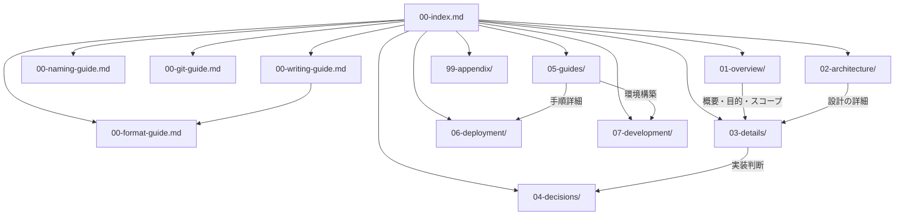

# ドキュメント マップ

> Status: Active
> 最終更新: 2026-01-23

全ドキュメントのナビゲーション。目的に応じて適切なセクションを参照する。

---

## 構造概要

---

## 00-Meta（メタ情報）

| ファイル | Status | 概要 |
|---------|--------|------|
| [00-index.md](./00-index.md) | Active | ドキュメント マップ（本ファイル） |
| [00-writing-guide.md](./00-writing-guide.md) | Active | 記載規範（文章品質・用語） |
| [00-format-guide.md](./00-format-guide.md) | Active | フォーマット規範（構造・分量・メタ情報・図・命名） |
| [00-naming-guide.md](./00-naming-guide.md) | Active | 命名規範（コード・DB・API） |
| [00-git-guide.md](./00-git-guide.md) | Active | Git規範（コミット・ブランチ・CHANGELOG） |

---

## 01-overview/（全体像）

| ファイル | Status | 概要 |
|---------|--------|------|
| [summary.md](./01-overview/summary.md) | Active | プロジェクト概要・Core Value |
| [goals.md](./01-overview/goals.md) | Active | 目的・解決する課題 |
| [scope.md](./01-overview/scope.md) | Active | スコープ・対象外 |

---

## 02-architecture/（設計）

| ファイル | Status | 概要 |
|---------|--------|------|
| [context.md](./02-architecture/context.md) | Active | システム境界（C4 Context） |
| [structure.md](./02-architecture/structure.md) | Active | コンポーネント構成（C4 Container） |
| [tech-stack.md](./02-architecture/tech-stack.md) | Active | 技術スタック・選定理由 |

---

## 03-details/（詳細）

| ファイル | Status | 概要 |
|---------|--------|------|
| [data-model.md](./03-details/data-model.md) | Active | データモデル・ER図 |
| [api.md](./03-details/api.md) | Active | API設計・エラーコード |
| [flows.md](./03-details/flows.md) | Active | 主要フロー（認証・データ取得） |
| [duel-recording.md](./03-details/duel-recording.md) | Active | 対戦記録機能 |
| [statistics.md](./03-details/statistics.md) | Active | 統計機能 |
| [sharing.md](./03-details/sharing.md) | Active | 共有機能 |
| [streamer-popup.md](./03-details/streamer-popup.md) | Active | 配信者ポップアップ |
| [screen-analysis.md](./03-details/screen-analysis.md) | Active | 画面解析機能 |

---

## 04-decisions/（ADR）

| ファイル | Status | 概要 |
|---------|--------|------|
| [0001-supabase-auth.md](./04-decisions/0001-supabase-auth.md) | Active | Supabase Auth採用 |
| [0002-hono-backend.md](./04-decisions/0002-hono-backend.md) | Active | Hono採用 |
| [0003-react-frontend.md](./04-decisions/0003-react-frontend.md) | Active | React + shadcn/ui採用 |
| [0004-vercel-fullstack.md](./04-decisions/0004-vercel-fullstack.md) | Active | Vercelフルスタック構成 |
| [0005-fullstack-typescript.md](./04-decisions/0005-fullstack-typescript.md) | Active | Full-Stack TypeScript統一 |

---

## 05-guides/（How-toガイド）

| ファイル | Status | 概要 |
|---------|--------|------|
| [quickstart.md](./05-guides/quickstart.md) | Active | クイックスタート |
| [testing.md](./05-guides/testing.md) | Active | テスト実行方法 |
| [deployment.md](./05-guides/deployment.md) | Active | デプロイ手順 |
| [troubleshooting.md](./05-guides/troubleshooting.md) | Active | トラブルシューティング |

---

## 06-deployment/（デプロイ設定）

| ファイル | Status | 概要 |
|---------|--------|------|
| [vercel.md](./06-deployment/vercel.md) | Active | Vercel設定 |
| [supabase.md](./06-deployment/supabase.md) | Active | Supabase設定 |
| [ci-cd.md](./06-deployment/ci-cd.md) | Active | CI/CDパイプライン |

---

## 07-development/（開発者向け）

| ファイル | Status | 概要 |
|---------|--------|------|
| [environment-setup.md](./07-development/environment-setup.md) | Active | 環境構築 |
| [contributing.md](./07-development/contributing.md) | Active | コントリビューションガイド |

---

## 99-appendix/（付録）

| ファイル | Status | 概要 |
|---------|--------|------|
| [glossary.md](./99-appendix/glossary.md) | Active | 用語集 |

---

## 読み方ガイド

| 目的 | 推奨パス |
|------|---------|
| プロジェクト全体を理解したい | summary → context → structure → flows |
| 開発環境をセットアップしたい | quickstart → environment-setup |
| APIを実装・利用したい | api → data-model → flows |
| デプロイしたい | deployment → vercel / supabase |
| 設計判断の背景を知りたい | 04-decisions/ の各ADR |
| 個別機能の詳細を知りたい | 03-details/ の各機能ドキュメント |

---

## 関連ドキュメント

- [00-writing-guide.md](./00-writing-guide.md) - 文章品質・用語に関する記載規範
- [00-format-guide.md](./00-format-guide.md) - 構造・分量・メタ情報・図・命名のフォーマット規範
- [00-naming-guide.md](./00-naming-guide.md) - コード・DB・APIの命名規約
- [00-git-guide.md](./00-git-guide.md) - コミット・ブランチ命名・変更履歴管理のGit規範
- [CLAUDE.md](../CLAUDE.md) - AI向けプロジェクト概要
