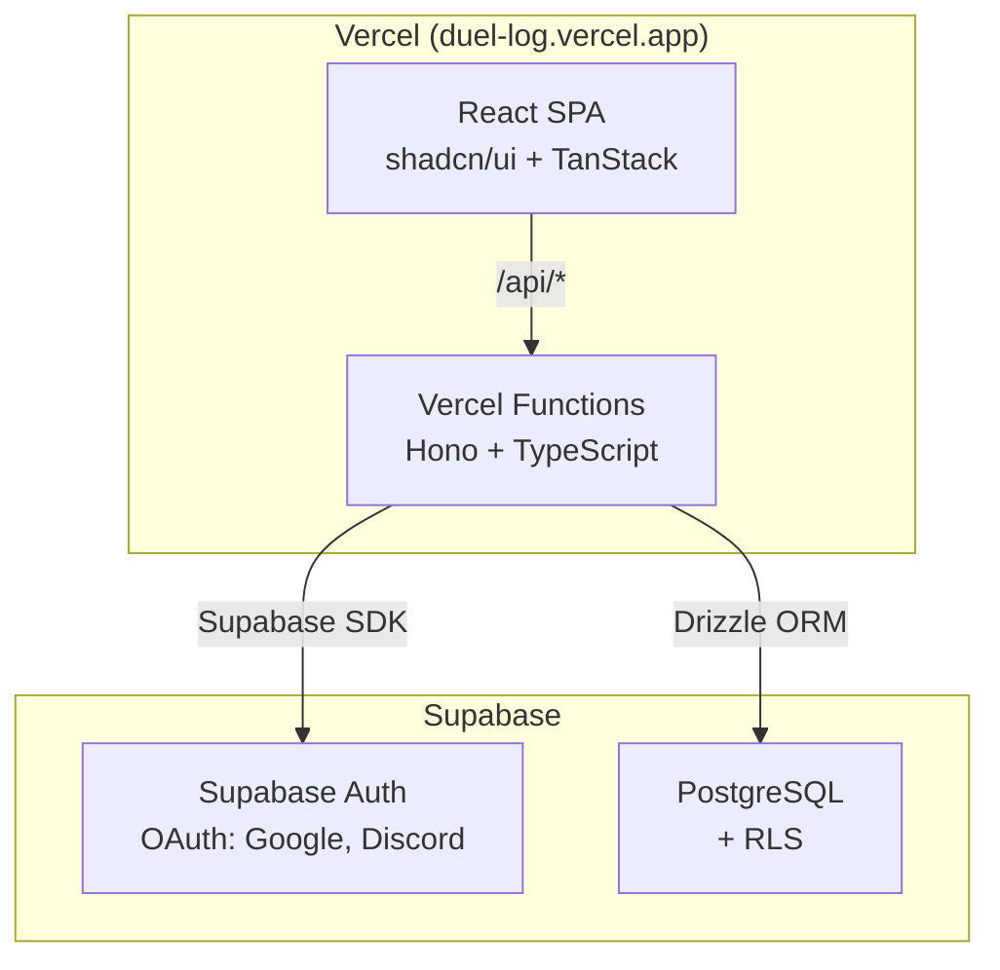

# Duel Log App 概要

> Status: Active
> 最終更新: 2026-01-23

遊戯王マスターデュエルの対戦履歴を記録・分析するWebアプリケーション。ユーザーの対戦データを統計情報として可視化し、デッキ分析や配信者サポートを提供する。

---

## Core Value

| 価値 | 説明 |
|------|------|
| **対戦履歴の可視化** | 勝敗、デッキ、対戦相手を統計情報として可視化 |
| **デッキ分析** | デッキごとの勝率、相性表、トレンド分析 |
| **配信者サポート** | 配信者ポップアップ、配信者モード（プライバシー保護） |
| **データポータビリティ** | CSVインポート/エクスポート、統計情報共有URL |

---

## 主要機能

| 機能 | 説明 |
|------|------|
| 対戦記録 | 勝敗、デッキ、対戦相手、ゲームモード、ターン順を記録 |
| デッキ管理 | 自分のデッキと対戦相手のデッキを管理 |
| 統計情報 | 勝率、先攻/後攻勝率、コイントス勝率、期間別統計 |
| デッキ相性表 | デッキ間の勝率マトリックス |
| 配信者ポップアップ | 配信用のリアルタイム統計表示 |
| 統計共有 | URLベースの統計情報公開 |
| 配信者モード | プライバシー保護（個人情報マスク） |
| 画面解析 | 配信画面からの自動対戦記録 |

---

## システム構成（概観）



---

## プロジェクト構造（モノレポ）

```
duel-log-app/
├── apps/
│   └── web/                    # フロントエンド（React）
├── packages/
│   ├── api/                    # バックエンド（Hono）
│   └── shared/                 # 共有コード（Zodスキーマ）
├── docs/                       # ドキュメント
├── pnpm-workspace.yaml
└── package.json
```

---

## 関連ドキュメント

- [goals.md](./goals.md) - 目的・解決する課題
- [scope.md](./scope.md) - スコープ・対象外
- [context.md](../02-architecture/context.md) - システム境界
- [tech-stack.md](../02-architecture/tech-stack.md) - 技術スタック
