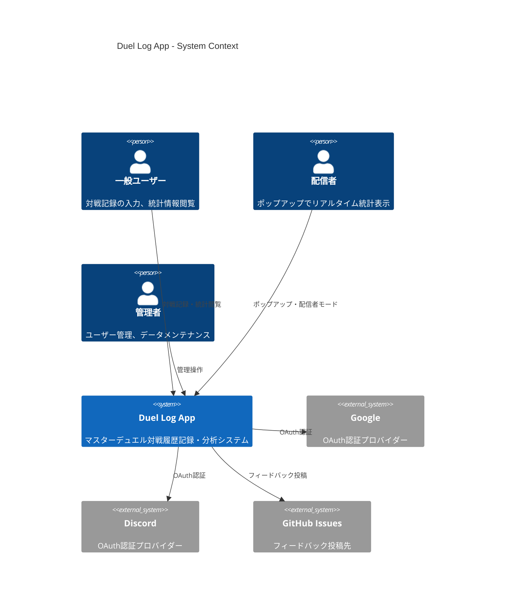

# システム境界

> Status: Active
> 最終更新: 2026-01-23

Duel Log Appのシステム境界と外部連携を定義する（C4 Contextレベル）。

---

## C4 Context図

システムと外部アクター・システムの関係を示す。

---

## 外部システム連携

| 外部システム | 連携内容 | プロトコル |
|-------------|---------|-----------|
| Google OAuth | ユーザー認証 | HTTPS (OAuth 2.0) |
| Discord OAuth | ユーザー認証 | HTTPS (OAuth 2.0) |
| GitHub Issues API | フィードバック投稿 | HTTPS (REST) |

---

## セキュリティ境界

| 境界 | 内容 |
|------|------|
| Public Internet | Frontend静的ファイル、Backend API（認証必須）、共有統計URL（トークンベース） |
| Supabase (Managed) | PostgreSQL Database、Row Level Security、管理者APIは追加認可 |

---

## 通信プロトコル

| 経路 | プロトコル | 認証 |
|------|-----------|------|
| Frontend ↔ Backend | HTTPS/REST | Bearer Token (JWT) |
| Frontend ↔ Supabase Auth | HTTPS | Supabase SDK |
| Backend ↔ Database | PostgreSQL | 接続文字列 |
| Backend → Supabase Auth | HTTPS | JWT検証 (JWKS) |

---

## デプロイ構成

| 環境 | サービス | URL |
|------|----------|-----|
| 本番 | Vercel | https://duel-log.vercel.app |
| 本番 DB | Supabase Cloud | （内部接続） |
| 開発 | ローカル（pnpm dev） | http://localhost:5173 |
| 開発 DB | ローカルSupabase | http://127.0.0.1:54321 |

---

## 関連ドキュメント

- [structure.md](./structure.md) - コンポーネント構成
- [tech-stack.md](./tech-stack.md) - 技術スタック
- [0004-vercel-fullstack.md](../04-decisions/0004-vercel-fullstack.md) - アーキテクチャ決定
