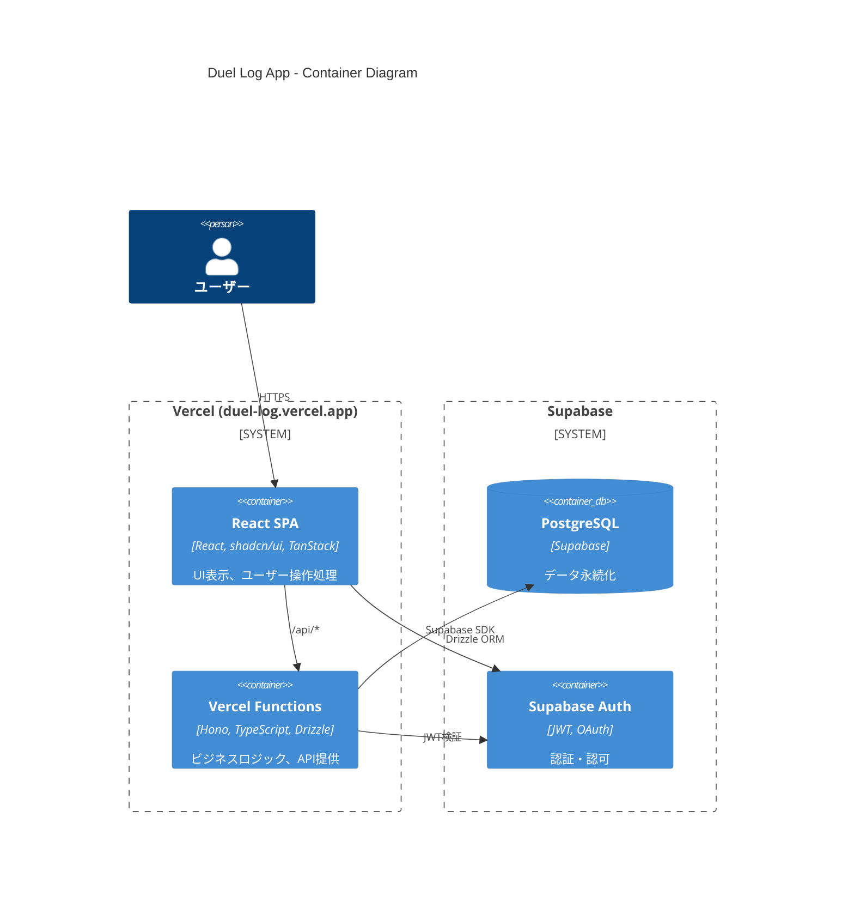

# コンポーネント構成

> Status: Active
> 最終更新: 2026-01-23

Duel Log Appの主要コンポーネント構成を定義する（C4 Containerレベル）。

---

## C4 Container図



---

## コンテナ詳細

| コンテナ | 技術 | 責務 |
|---------|------|------|
| Frontend | React / TypeScript / shadcn/ui | UI表示、ユーザー操作処理 |
| Backend | Hono / TypeScript / Drizzle | ビジネスロジック、API提供 |
| Database | PostgreSQL (Supabase) | データ永続化 |
| Auth | Supabase Auth | 認証・認可 |

---

## 同一ドメイン構成

```
duel-log.vercel.app
├── /              → React SPA (静的ファイル)
├── /dashboard     → React SPA (クライアントルーティング)
├── /statistics    → React SPA (クライアントルーティング)
└── /api/*         → Vercel Functions (サーバーサイド)
```

CORS設定不要、Cookie共有が容易、単一デプロイの利点がある。

---

## フロントエンド構成

### ディレクトリ構造

```
apps/web/src/
├── components/           # UIコンポーネント
│   ├── ui/              # shadcn/ui コンポーネント
│   ├── common/          # 共通コンポーネント
│   ├── dashboard/       # ダッシュボード
│   └── admin/           # 管理者
├── hooks/               # カスタムフック
├── stores/              # Zustand stores
├── routes/              # TanStack Router
└── lib/                 # ユーティリティ
```

### 状態管理

| 種類 | ツール | 対象 |
|------|--------|------|
| サーバー状態 | TanStack Query | デュエル一覧、統計データ、デッキ一覧 |
| クライアント状態 | Zustand | 認証状態、テーマ、UI設定 |

---

## 共有パッケージ構成

### ディレクトリ構造

```
packages/shared/
├── schemas/              # Zodスキーマ
│   ├── user.ts
│   ├── deck.ts
│   ├── duel.ts
│   ├── statistics.ts
│   └── shared-statistics.ts
├── types/                # 型定義（Zodからinfer）
├── constants/            # 定数（GameMode, Result等）
└── errors/               # エラーコード定義
```

フロントエンド・バックエンドで共有するZodスキーマと型定義を管理する。

---

## バックエンド構成

### ディレクトリ構造

```
packages/api/
├── index.ts              # Honoアプリ エントリポイント
├── routes/               # APIルート
├── services/             # ビジネスロジック
├── middleware/           # ミドルウェア
├── db/                   # データベース
│   ├── schema.ts        # Drizzle スキーマ
│   └── migrations/      # マイグレーション
└── lib/                  # ユーティリティ
```

### レイヤードアーキテクチャ

| レイヤー | 責務 |
|---------|------|
| Route | HTTPハンドリング、Zodバリデーション、OpenAPIスキーマ |
| Middleware | JWT検証、管理者権限検証、エラー変換 |
| Service | ビジネスロジック、トランザクション管理 |
| Data | Drizzle ORMスキーマ、クエリビルダー |

---

## 関連ドキュメント

- [context.md](./context.md) - システム境界
- [tech-stack.md](./tech-stack.md) - 技術スタック
- [data-model.md](../03-details/data-model.md) - データモデル
