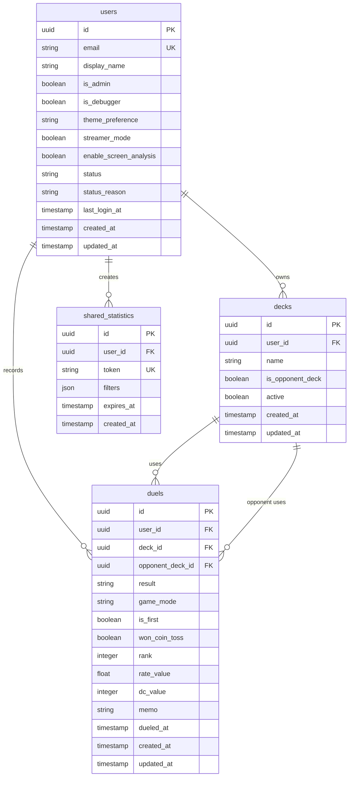

# データモデル

> Status: Active
> 最終更新: 2026-01-23

Duel Log AppのER図とスキーマ定義を記載する。詳細なスキーマ定義は`packages/api/db/schema.ts`がSSoTである。

---

## ER図

---

## テーブル定義

### users

| カラム | 型 | 説明 |
|--------|-----|------|
| id | UUID | 主キー（Supabase Auth UIDと同一） |
| email | TEXT | メールアドレス（一意） |
| display_name | TEXT | 表示名 |
| is_admin | BOOLEAN | 管理者フラグ |
| is_debugger | BOOLEAN | デバッガーフラグ |
| theme_preference | TEXT | テーマ設定（light/dark/system） |
| streamer_mode | BOOLEAN | 配信者モード |
| enable_screen_analysis | BOOLEAN | 画面解析機能ON/OFF |
| status | TEXT | ステータス（active/banned/suspended） |
| status_reason | TEXT | ステータス変更理由（NULL可） |
| last_login_at | TIMESTAMPTZ | 最終ログイン日時（NULL可） |
| created_at | TIMESTAMPTZ | 作成日時 |
| updated_at | TIMESTAMPTZ | 更新日時 |

### decks

| カラム | 型 | 説明 |
|--------|-----|------|
| id | UUID | 主キー |
| user_id | UUID | 所有ユーザー（FK: users） |
| name | TEXT | デッキ名 |
| is_opponent_deck | BOOLEAN | 対戦相手デッキフラグ |
| active | BOOLEAN | アクティブフラグ（デフォルト: true） |
| created_at | TIMESTAMPTZ | 作成日時 |
| updated_at | TIMESTAMPTZ | 更新日時 |

### duels

| カラム | 型 | 説明 |
|--------|-----|------|
| id | UUID | 主キー |
| user_id | UUID | 記録者（FK: users） |
| deck_id | UUID | 使用デッキ（FK: decks） |
| opponent_deck_id | UUID | 対戦相手デッキ（FK: decks） |
| result | TEXT | 結果（win/loss） |
| game_mode | TEXT | ゲームモード |
| is_first | BOOLEAN | 先攻フラグ |
| won_coin_toss | BOOLEAN | コイントス勝利フラグ |
| rank | INTEGER | ランク値（NULL可、RANKモード時） |
| rate_value | REAL | レート値（NULL可、RATEモード時） |
| dc_value | INTEGER | DCポイント（NULL可、DCモード時） |
| memo | TEXT | メモ（NULL可） |
| dueled_at | TIMESTAMPTZ | 対戦日時 |
| created_at | TIMESTAMPTZ | 作成日時 |
| updated_at | TIMESTAMPTZ | 更新日時 |

**制約:**

| 制約 | カラム | 許容値 |
|------|--------|--------|
| CHECK | result | 'win', 'loss' |
| CHECK | game_mode | 'RANK', 'RATE', 'EVENT', 'DC' |

**インデックス:**

| インデックス名 | カラム | 用途 |
|---------------|--------|------|
| idx_duels_user_mode_date | user_id, game_mode, dueled_at | ゲームモード別フィルタ |
| idx_duels_user_deck_result | user_id, deck_id, result | デッキ別勝率計算 |
| idx_duels_matchup | user_id, deck_id, opponent_deck_id, result | 相性表計算 |

### shared_statistics

| カラム | 型 | 説明 |
|--------|-----|------|
| id | UUID | 主キー |
| user_id | UUID | 所有ユーザー（FK: users） |
| token | TEXT | 共有トークン（一意） |
| filters | JSONB | フィルター条件 |
| expires_at | TIMESTAMPTZ | 有効期限（NULL可） |
| created_at | TIMESTAMPTZ | 作成日時 |

---

## リレーション

| 関係 | 説明 |
|------|------|
| User 1→N Deck | ユーザーは複数のデッキを所有 |
| User 1→N Duel | ユーザーは複数の対戦を記録 |
| Duel N→1 Deck (deck_id) | 対戦は使用デッキを参照 |
| Duel N→1 Deck (opponent_deck_id) | 対戦は対戦相手デッキを参照 |

---

## 関連ドキュメント

- [api.md](./api.md) - API設計
- [structure.md](../02-architecture/structure.md) - コンポーネント構成
