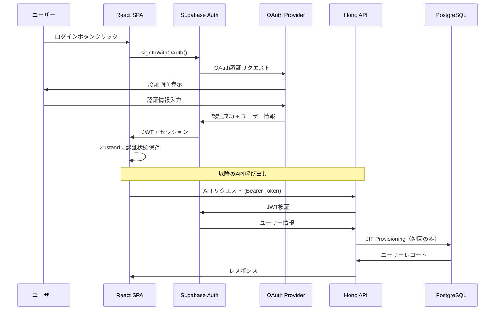
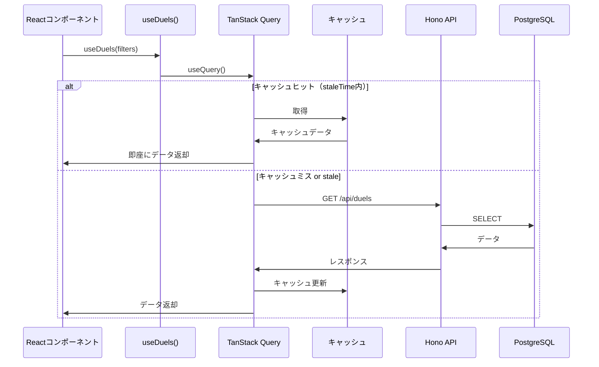
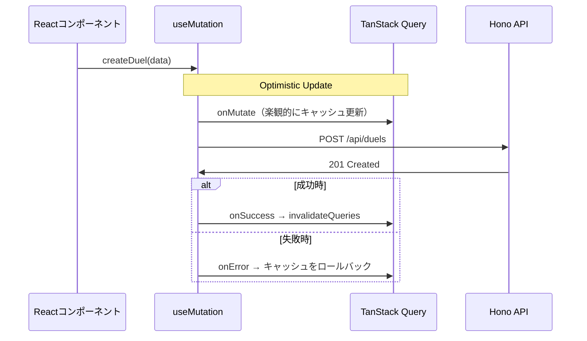
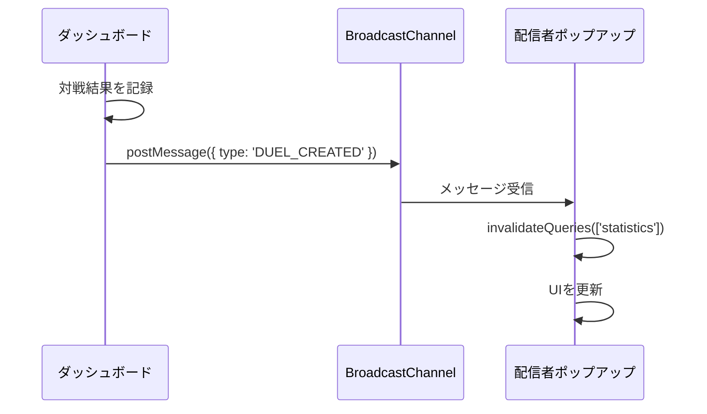

# 主要フロー

> Status: Active
> 最終更新: 2026-01-23

Duel Log Appの主要な処理フロー（認証、データ取得、リアルタイム更新）を定義する。

---

## 認証フロー

### OAuth認証シーケンス

### JIT (Just-In-Time) Provisioning

Supabase Authで認証後、初回API呼び出し時にユーザーをDBに自動作成する。

| ステップ | 処理 |
|---------|------|
| 1 | JWT検証（Supabase Auth） |
| 2 | usersテーブルでユーザーを検索 |
| 3a | 存在する場合 → そのまま続行 |
| 3b | 存在しない場合 → INSERT実行 |
| 4 | コンテキストにユーザー情報を設定 |

---

## データ取得フロー

### TanStack Query によるデータフェッチ

### データ更新フロー（Optimistic Update）

---

## リアルタイム更新（配信者ポップアップ）

### BroadcastChannel によるタブ間通信

### 通信パターン

| イベント | 送信元 | 処理内容 |
|---------|-------|---------|
| DUEL_CREATED | ダッシュボード | デュエル・統計キャッシュを無効化 |
| DUEL_UPDATED | ダッシュボード | デュエル・統計キャッシュを無効化 |
| DUEL_DELETED | ダッシュボード | デュエル・統計キャッシュを無効化 |

---

## 認可モデル

### ロールベースアクセス制御

| ロール | 権限 |
|--------|------|
| user | 自分のデータのみCRUD |
| admin | 全ユーザーデータ閲覧、ステータス変更 |
| debugger | デバッグ機能へのアクセス |

### Row Level Security (RLS)

| テーブル | 操作 | ポリシー |
|---------|------|---------|
| duels | SELECT/INSERT/UPDATE/DELETE | `user_id = auth.uid()` |
| decks | SELECT/INSERT/UPDATE/DELETE | `user_id = auth.uid()` |
| shared_statistics | SELECT (public) | tokenによるアクセス（認証不要） |
| shared_statistics | INSERT/UPDATE/DELETE | `user_id = auth.uid()` |
| 全テーブル | ALL (admin) | usersテーブルでis_admin=trueの場合バイパス |

---

## エラーハンドリングフロー

| エラー種別 | フロントエンド処理 |
|-----------|------------------|
| 401 Unauthorized | ログイン画面へリダイレクト |
| 400 Validation | フォームにフィールドエラーを表示 |
| 403 Forbidden | Toastでエラーメッセージを表示 |
| 404 Not Found | 「見つかりません」ページを表示 |
| 5xx Server Error | リトライを促すToastを表示 |

---

## 関連ドキュメント

- [api.md](./api.md) - API設計
- [data-model.md](./data-model.md) - データモデル
- [0001-supabase-auth.md](../04-decisions/0001-supabase-auth.md) - Supabase Auth採用ADR
