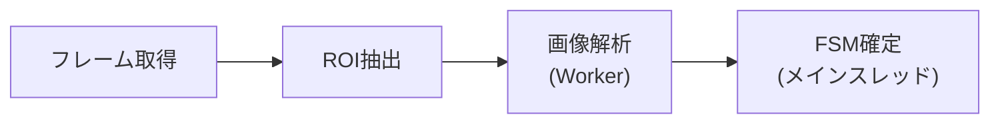
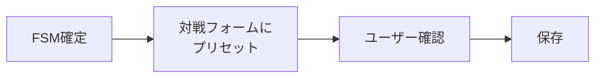

# 画面録画分析

> Status: Active
> 最終更新: 2026-01-23

ブラウザの画面録画からコイントス・勝敗を自動検出

---

## 概要

| 項目 | 内容 |
|------|------|
| 目的 | 画面録画分析の設計ドキュメント |
| 状態 | ✅ 実装済み |
| 対象読者 | 開発者 |

---

## 実装状況

| 機能 | 状態 |
|------|:----:|
| コイントス結果検出 | ✅ |
| 勝敗判定（VICTORY/LOSE） | ✅ |
| 複数解像度対応（720p〜2160p） | ✅ |
| ユーザー設定ON/OFF | ✅ |
| FSM状態管理 | ✅ |
| 自動対戦記録作成 | ✅ |

---

## 検出対象

| 対象 | 説明 |
|------|------|
| 先攻/後攻選択画面 | 選択権ありを検出 |
| 勝敗画面 | VICTORY/LOSE判定 |

---

## アーキテクチャ

### パイプライン



| ステップ | 説明 |
|---------|------|
| フレーム取得 | `getDisplayMedia()` + OffscreenCanvas |
| ROI抽出 | 比率ベースの固定領域切り出し |
| 画像解析 | OCR + 色解析（Web Worker） |
| FSM確定 | メインスレッドで時系列管理 |

### ファイル構成

```
src/
├── composables/
│   └── useScreenAnalysis.ts      # 統合Composable + FSM
├── workers/
│   └── screenAnalysisOCR.worker.ts  # ML分類Worker
└── utils/
    └── screenAnalysis/
        ├── config.ts             # 統合設定
        ├── fsm.ts                # FSM状態機械
        └── types.ts              # 型定義
```

---

## FSM（有限状態機械）

### 状態遷移図

```
┌─────────────────────────────────────────────────────────────────┐
│                          FSM States                              │
│                                                                  │
│  [IDLE] ──────────────────────────────────────────────────────┐ │
│    │                                                          │ │
│    │ コイン検出                                               │ │
│    ▼                                                          │ │
│  [COIN_DETECTED] ──── 確定条件達成 ────▶ [COIN_CONFIRMED]    │ │
│    │                                           │              │ │
│    │ タイムアウト                              │ 次の対戦     │ │
│    ▼                                           ▼              │ │
│  [IDLE] ◀─────────────────────────── [WAITING_RESULT]        │ │
│                                                │              │ │
│                                                │ 勝敗検出     │ │
│                                                ▼              │ │
│                                        [RESULT_DETECTED]      │ │
│                                                │              │ │
│                                                │ 確定条件達成 │ │
│                                                ▼              │ │
│                                        [RESULT_CONFIRMED] ────┘ │
└─────────────────────────────────────────────────────────────────┘
```

### 確定条件

| イベント | 確定条件 | クールダウン |
|---------|---------|-------------|
| コイン | 5フレーム連続一致 | 15秒 |
| 勝敗 | 3フレーム連続一致 | 12秒 |

---

## 解析パラメータ

| パラメータ | 値 |
|-----------|-----|
| スキャンFPS | 5 fps |
| コイン確定条件 | 5フレーム連続一致 |
| 勝敗確定条件 | 3フレーム連続一致 |
| コインクールダウン | 15秒 |
| 勝敗クールダウン | 12秒 |

---

## 画像解析

### コイン検出（OCR）

| 項目 | 内容 |
|------|------|
| エンジン | Tesseract.js v7 |
| 言語 | 日本語（`jpn`） |
| 前処理 | グレースケール + コントラスト強調 |
| 判定 | キーワードマッチング |

判定キーワード：

| キーワード | 結果 |
|-----------|------|
| 「先攻・後攻を選択してください」 | コイン勝利 |
| 「選択しています」 | コイン敗北 |

### 勝敗検出（色解析）

| 項目 | 内容 |
|------|------|
| 手法 | HSV色空間での金色ピクセル解析 |
| 対象色 | Hue: 15-55°, Saturation: ≥40%, Value: ≥50% |
| 判定1 | 王冠の金色集中度（VICTORY判定） |
| 判定2 | OKボタン検出（暗色ピクセル分布） |

---

## ROI（Region of Interest）

### コイン領域

画面中央付近の選択権表示エリア。

### 勝敗領域

画面中央の VICTORY/LOSE 表示エリア。

### 解像度正規化

全ての解像度を比率ベースで処理し、720p〜2160pに対応。

---

## プライバシー

| 項目 | 対策 |
|------|------|
| 処理場所 | クライアント（ブラウザ）内で完結 |
| 送信データ | フレーム画像は送信しない |
| 保存 | イベント・メタ情報のみ |
| デバッグ画像 | デバッガー専用オプトイン |

---

## 対戦記録への統合

### フロー



### プリセット項目

| 検出イベント | プリセット項目 |
|-------------|---------------|
| コイン勝利 | `wonCoinToss: true`, `isFirst: ?` |
| コイン敗北 | `wonCoinToss: false` |
| VICTORY | `result: 'win'` |
| LOSE | `result: 'loss'` |

---

## 設定

### ユーザー設定

| 設定 | 説明 |
|------|------|
| `enable_screen_analysis` | 機能のON/OFF |
| `is_debugger` | デバッグ画像保存の有効化 |

### 設定UI

プロフィール設定画面で ON/OFF を切り替え。

---

## 関連ドキュメント

| ドキュメント | 内容 |
|------------|------|
| [対戦記録機能](./duel-recording.md) | 対戦記録機能 |
| [フロントエンド構造](../../02-architecture/structure.md) | フロントエンド構造 |
