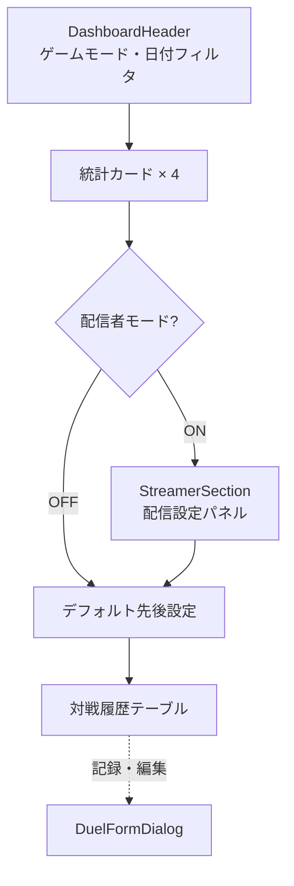

# ダッシュボード

> Status: Active
> 最終更新: 2026-01-24

## 画面概要

| 項目 | 内容 |
|------|------|
| パス | `/` |
| 目的 | 対戦履歴の閲覧・記録・エクスポートを行うメイン画面 |
| アクセス権 | 認証必須 |
| レスポンシブ | モバイル: 対戦記録セクション非表示、FABボタンでダイアログ表示 |

---

## 表示データ

### 統計カード（4枚）

| データ項目 | 表示形式 | データソース |
|-----------|---------|-------------|
| 総対戦数 | 整数 | duels集計 |
| 勝率 | パーセンテージ（勝-敗内訳併記） | duels集計 |
| 先攻率 | パーセンテージ | duels集計 |
| コイントス勝率 | パーセンテージ | duels集計 |

### 連勝・連敗バッジ

| データ項目 | 表示形式 | データソース |
|-----------|---------|-------------|
| 連勝/連敗 | 種類ラベル + 数値（勝=緑, 敗=赤） | duels集計 |

### 対戦履歴テーブル

| 列 | 表示形式 |
|----|---------|
| 日時 | YYYY-MM-DD |
| 結果 | WIN/LOSS（色分け） |
| 自デッキ | デッキ名 |
| 相手デッキ | デッキ名 |
| 先攻/後攻 | アイコン |
| ゲームモード | RANK/RATE/EVENT/DC |
| 操作 | 編集・削除ボタン |

---

## ユーザー操作

| 操作 | トリガー | 結果 |
|------|---------|------|
| 対戦記録 | 記録ボタン / FAB | DuelFormDialog表示 |
| CSV取込 | 取込ボタン | ファイル選択ダイアログ（.csv） |
| CSVエクスポート | エクスポートボタン | CSVファイルダウンロード |
| 共有リンク生成 | 共有ボタン | ShareStatsDialog表示 |
| ゲームモード切替 | タブ選択 | 全統計・履歴をフィルタ |
| 年月選択 | ドロップダウン | 表示期間を変更 |
| 対戦編集 | 行内編集ボタン | DuelFormDialog（編集モード） |
| 対戦削除 | 行内削除ボタン | 2段階確認ダイアログ |
| デフォルト先後設定 | トグルボタン | localStorageに保存 |

---

## DuelFormDialog

| フィールド | 型 | 必須 | バリデーション |
|-----------|-----|:---:|--------------|
| 結果 | ラジオ（Win/Loss） | ✅ | 選択必須 |
| ゲームモード | セレクタ（RANK/RATE/EVENT/DC） | ✅ | 選択必須 |
| 自デッキ | ドロップダウン（アクティブのみ） | ✅ | 選択必須 |
| 相手デッキ | ドロップダウン（アクティブのみ） | ✅ | 選択必須 |
| 先攻 | チェックボックス | - | - |
| コイントス勝ち | チェックボックス | - | - |
| ランク値 | 数値入力 | - | RANK時のみ表示 |
| レート値 | 数値入力 | - | RATE時のみ表示 |
| DC値 | 数値入力 | - | DC時のみ表示 |
| メモ | テキストエリア | - | - |

---

## 配信セクション（StreamerSection）

配信者モードが有効な場合のみ表示される。統計カードの直下に配置される。

### 表示条件

| 条件 | 判定元 | 効果 |
|------|--------|------|
| 配信者モードON | localStorage OR DB（いずれかがtrue） | 配信セクションを表示 |
| 配信者モードOFF | 両方false | 配信セクションを非表示 |

### パネル構成

アコーディオン形式の2パネルで構成される。初期展開はポップアップパネルである。

| パネル | 推奨度 | 認証方式 | 更新方式 |
|--------|--------|---------|---------|
| ポップアップウィンドウ | 推奨 | Supabaseセッション | BroadcastChannel + スマートポーリング |
| OBSブラウザソース | 非推奨（警告表示） | 共有トークン | スマートポーリング |

### ポップアップ設定（StreamerPopupSettings）

localStorageに設定を保存する。未保存変更のインジケータ付き。

| 設定 | 選択肢 | デフォルト |
|------|--------|-----------|
| ゲームモード | RANK / RATE / EVENT / DC | RANK |
| 統計期間 | 月別 / 配信開始以降（session） | 月別 |
| テーマ | ダーク / ライト | ダーク |
| レイアウト | グリッド / 横 / 縦 | グリッド |
| クロマキー | なし / 緑 / 青 | なし |
| 表示項目 | ドラッグドロップで選択・並び替え | 勝率のみ |

### OBS設定（OBSConfigPanel）

「OBS URLを取得」ボタンで設定モーダルを表示する。モーダル内でパラメータを設定し、URLをクリップボードにコピーする。

| 設定 | 選択肢 | デフォルト |
|------|--------|-----------|
| 集計期間 | 月別 / 直近N件 / 開始以降 | 月別 |
| ゲームモード | RANK / RATE / EVENT / DC | 未指定 |
| レイアウト | グリッド / 横 / 縦 | グリッド |
| テーマ | ダーク / ライト | ダーク |
| 更新間隔 | 秒数指定 | 30秒 |
| 表示項目 | ドラッグドロップで選択・並び替え | 勝率のみ |

### 表示項目（選択可能）

| 項目キー | ラベル | デフォルト |
|---------|--------|:---------:|
| currentDeck | 現在のデッキ | - |
| gameModeValue | モード値 | - |
| totalDuels | 総対戦数 | - |
| winRate | 勝率 | ✅ |
| firstTurnWinRate | 先攻勝率 | - |
| secondTurnWinRate | 後攻勝率 | - |
| coinWinRate | コイントス勝率 | - |
| goFirstRate | 先攻率 | - |

### ユーザー操作

| 操作 | パネル | 結果 |
|------|--------|------|
| 設定保存 | ポップアップ | localStorageに保存 |
| リセット | ポップアップ | 全設定をデフォルトに戻す |
| ポップアップを開く | ポップアップ | 未保存なら自動保存 → 新規ウィンドウ起動 |
| OBS URLを取得 | OBS | 設定モーダルを表示 |
| URLコピー | OBSモーダル | クリップボードにURLをコピー |

---

## 画面構成図

---

## 状態

| 状態 | 条件 | 表示内容 |
|------|------|---------|
| ローディング | データ取得中 | スピナー |
| 空 | 対戦履歴なし | アイコン + 「記録を追加してください」 |
| エラー | API通信失敗 | トースト通知 |

---

## 関連ドキュメント

- [../ui.md](../ui.md) - 画面一覧・共通パターン
- [../duel-recording.md](../duel-recording.md) - 対戦記録機能の詳細仕様
- [decks.md](./decks.md) - デッキ管理（ドロップダウンのデータ元）
- [streamer-popup.md](./streamer-popup.md) - 配信者ポップアップ（ポップアップウィンドウの表示仕様）
- [obs-overlay.md](./obs-overlay.md) - OBSオーバーレイ（ブラウザソースの表示仕様）
- [profile.md](./profile.md) - プロフィール（配信者モードの有効化）
