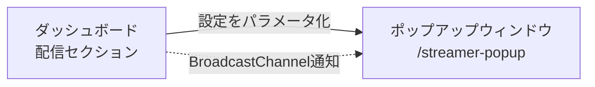

# 配信者ポップアップ

> Status: Active
> 最終更新: 2026-01-24

## 画面概要

| 項目 | 内容 |
|------|------|
| パス | `/streamer-popup` |
| 目的 | 配信画面に重ねて表示するリアルタイム統計ウィジェット |
| アクセス権 | 内部認証（Supabaseセッション必須） |
| レスポンシブ | 固定サイズ（配信用途のため） |
| 起動元 | ダッシュボードの配信セクション（ポップアップウィンドウパネル） |

### 起動フロー

ダッシュボードの配信セクションから新規ウィンドウとして起動される。設定値はダッシュボード側で選択し、クエリパラメータとして渡される。

---

## クエリパラメータ

ダッシュボードの配信セクションで選択した設定がパラメータとして渡される。

| パラメータ | 型 | デフォルト | 説明 |
|-----------|-----|-----------|------|
| items | string | 'winRate' | 表示項目（カンマ区切り） |
| game_mode | string | 'RANK' | RANK / RATE / EVENT / DC |
| stats_period | string | 'monthly' | monthly / session |
| theme | string | 'dark' | dark / light |
| layout | string | 'grid' | grid / horizontal / vertical |
| refresh | number | 5000 | フォールバック更新間隔（ミリ秒） |
| from_timestamp | string | null | sessionモード時の開始タイムスタンプ（ISO形式） |

---

## 表示データ

| データ項目 | 表示形式 | データソース |
|-----------|---------|-------------|
| 現在のデッキ名 | テキスト | 最新対戦のデッキ |
| 勝率 | パーセンテージ | statistics API集計 |
| 先攻勝率 | パーセンテージ | statistics API集計 |
| 後攻勝率 | パーセンテージ | statistics API集計 |
| コイントス勝率 | パーセンテージ | statistics API集計 |
| 先攻率 | パーセンテージ | statistics API集計 |
| 総対戦数 | 整数 | statistics API集計 |
| モード値 | ランク名 / 小数値 | 最新対戦のrank/rate/dc |

各統計項目はアイコン（グラデーション背景）+ ラベル + 値（グラデーションテキスト）で表示する。

---

## データ更新方式

2つの方式を併用する。BroadcastChannelを主系統とし、スマートポーリングをフォールバックとする。

| 方式 | トリガー | 動作 |
|------|---------|------|
| BroadcastChannel | ダッシュボードで対戦記録が変更された時 | 通知受信 → statistics APIを再取得 |
| スマートポーリング | refreshパラメータの間隔（フォールバック） | 定期的にstatistics APIを再取得 |

### BroadcastChannel連携

| 項目 | 内容 |
|------|------|
| チャネル名 | `duel-log-updates` |
| メッセージ形式 | `{ type: 'duel-updated', timestamp: number }` |
| 受信時の動作 | statistics APIを再取得して表示を更新する |

BroadcastChannelは通知のみを送信する。統計データ本体はAPIから取得する。

### スマートポーリング

| 項目 | 内容 |
|------|------|
| 初期間隔 | refreshパラメータ値（デフォルト5000ms） |
| 最大間隔 | 60000ms（エラー時にバックオフ） |
| タブ非表示時 | ポーリングを一時停止する |

---

## クロマキー対応

| 設定値 | CSS背景 | 用途 |
|--------|---------|------|
| green | `#00ff00` | OBSのグリーンスクリーン除去 |
| blue | `#0000ff` | OBSのブルースクリーン除去 |
| なし | 透明 | 背景なし |

プロフィール設定（authStore.chromaKeyBackground）からlocalStorage経由で取得する。

---

## 初回リサイズ

ポップアップウィンドウとして開かれた場合（`window.opener`が存在する場合）、初回データ取得後にウィンドウサイズをコンテンツに合わせて自動調整する。gridレイアウトの場合はリサイズしない。

---

## 状態

| 状態 | 条件 | 表示内容 |
|------|------|---------|
| ローディング | 初回データ取得中 | 「Loading...」テキスト |
| 未認証 | セッションなし | 「ログインが必要」エラーメッセージ |
| エラー | 初回データ取得失敗 | エラーメッセージ |
| バックグラウンドエラー | 2回目以降の取得失敗 | 表示は変更しない（静かに失敗） |

---

## 関連ドキュメント

- [../ui.md](../ui.md) - 画面一覧・共通パターン
- [dashboard.md](./dashboard.md) - ダッシュボード（配信セクションからこの画面を起動）
- [obs-overlay.md](./obs-overlay.md) - OBSオーバーレイ（トークンベース版）
- [profile.md](./profile.md) - プロフィール（配信者モード・クロマキー設定）
