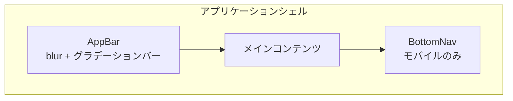

---
depends_on:
  - ../02-architecture/tech-stack.md
tags: [details, ui, visual, design-tokens, theme]
ai_summary: "UIの見た目（カラー・テーマ・レイアウト・インタラクション）を定義"
---

# UIビジュアル設計

> Status: Active
> 最終更新: 2026-01-24

UIの見た目に関する設計を定義する。

---

## デザイントークン

### カラーパレット

| セマンティック名 | 用途 | Light | Dark |
|-----------------|------|-------|------|
| primary | ブランドカラー・主要アクション | `#0288d1` | `#00d9ff` |
| secondary | 補助アクション | `#7b1fa2` | `#b536ff` |
| accent | 強調表示 | `#d81b60` | `#ff2d95` |
| background | ページ背景 | `#f5f5f5` | `#0a0e27` |
| surface | カード・ダイアログ背景 | `#ffffff` | `#12162e` |
| surface-variant | セクション背景 | `#e3f2fd` | `#1a1f3a` |
| on-background | 背景上のテキスト | `#1a1a1a` | `#e4e7ec` |
| on-surface | サーフェス上のテキスト | `#1a1a1a` | `#e4e7ec` |
| error | エラー状態 | `#f44336` | `#ff3d71` |
| success | 成功状態 | `#4caf50` | `#00e676` |
| warning | 警告状態 | `#ff9800` | `#ffaa00` |
| info | 情報表示 | `#2196f3` | `#0095ff` |

### タイポグラフィ

| 用途 | フォントファミリー | 備考 |
|------|-------------------|------|
| アプリ全体 | Segoe UI, Tahoma, Geneva, Verdana, sans-serif | Vuetifyデフォルト |
| 配信者ポップアップ | Roboto, Noto Sans JP, sans-serif | 日本語対応 |

### スペーシング・形状

| トークン | 値 | 用途 |
|---------|-----|------|
| border-radius-sm | 8px | チップ・ポップアップ項目 |
| border-radius-md | 12px | カード（StatCard） |
| border-radius-lg | 16px | ダイアログ |
| タッチターゲット最小 | 44px | モバイルのインタラクティブ要素 |

---

## テーマシステム

| 項目 | 内容 |
|------|------|
| デフォルトテーマ | Dark |
| 切替方式 | トグルボタン |
| 永続化 | localStorage + サーバー（認証時） |
| 対応テーマ数 | 2（Light / Dark） |

### テーマ切替時の振る舞い

| 条件 | 振る舞い |
|------|---------|
| 未認証ユーザー | localStorageに保存・復元 |
| 認証済みユーザー | サーバーに永続化 |
| 初回アクセス | Darkテーマを適用 |

---

## コンポーネント分類

### StatCard バリアント

| バリアント | グラデーション | 用途 |
|-----------|--------------|------|
| primary | `#00d9ff → #0095ff` | 総合統計 |
| success | `#00e676 → #00c853` | 勝利関連 |
| warning | `#ffaa00 → #ff6d00` | 注意統計 |
| secondary | `#b536ff → #8e24aa` | 補助統計 |
| teal | `#4db6ac → #00897b` | 追加統計 |

StatCardはborder-radius 12px、backdrop-filter blur(10px)で表示する。上端に3pxのグラデーションバーを配置する。

### 状態表現ルール

| 状態 | 表現方法 |
|------|---------|
| hover | translateY(-4px) + opacity 0.9 |
| disabled | opacity 0.5 |
| selected/active | primaryカラー + scale(1.1) |
| error | errorカラーのボーダー・テキスト |
| 勝利 | successカラー |
| 敗北 | errorカラー |

---

## レイアウトパターン

### シェル構造

AppBarは下端に2pxのグラデーションバー（primary → secondary → accent）を配置する。BottomNavはモバイル時のみ表示し、中央にFABボタンを配置する。

### レスポンシブ変換

| ブレークポイント | 幅 | ナビゲーション | コンテンツ幅 |
|-----------------|-----|---------------|-------------|
| モバイル (xs) | ~599px | BottomNav（固定72px） | 100% |
| タブレット (sm) | 600px~959px | AppBarメニュー | 100% |
| デスクトップ (md+) | 960px~ | AppBarメニュー | max-width制限 |

### コンポーネントのレスポンシブ変換

| コンポーネント | モバイル | デスクトップ |
|---------------|---------|-------------|
| DuelTable | カードリスト（結果インジケータ付き） | テーブル形式 |
| StatisticsContent | アコーディオン | タブ + テーブル |
| StatCard | 幅100%縦並び | グリッド配置 |

---

## インタラクションパターン

### ローディング表現

| パターン | 用途 |
|---------|------|
| スケルトン | テーブル行・カードデータの初回読込 |
| プログレスバー | ページ遷移・データ更新 |

### 空状態・エラー表現

| 状態 | 表現 |
|------|------|
| データなし | テキストメッセージ + アクションボタン |
| 通信エラー | エラーカラーのアラート表示 |

### アニメーション方針

| 種類 | duration | easing | 用途 |
|------|----------|--------|------|
| 入場（fadeIn） | 0.3s | ease-out | コンテンツ表示 |
| hover | 0.3s | ease | カード浮上・グロー |
| グロー点滅 | 3s | linear (infinite) | AppBarのグラデーションバー |
| マイクロ操作 | 0.15s~0.2s | ease | ボタン・トグル |

### グロー効果

主要なインタラクティブ要素にグロー効果を適用する。box-shadowにprimaryカラー（rgba(0, 217, 255)）を使用し、hover時に強度を上げる。

---

## 配信者ポップアップ固有

| 項目 | Dark | Light |
|------|------|-------|
| 背景 | rgba(30, 30, 35, 0.95) | rgba(255, 255, 255, 0.98) |
| ボーダー | rgba(0, 217, 255, 0.3) | rgba(100, 150, 200, 0.4) |
| テキストグラデーション | `#00d9ff → #b536ff` | `#0077cc → #7744dd` |
| クロマキー（緑） | `#00ff00` | - |
| クロマキー（青） | `#0000ff` | - |

配信者ポップアップはOBS等の配信ソフトに埋め込む用途で使用する。クロマキー背景に対応する。

---

## 関連ドキュメント

- [技術スタック](../02-architecture/tech-stack.md) - UIフレームワーク（React + shadcn/ui）
- [配信者ポップアップ](./streamer-popup.md) - 配信者向け機能の詳細
