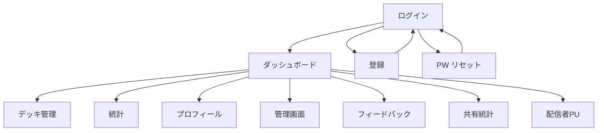

---
depends_on:
  - ../02-architecture/structure.md
  - ./flows.md
tags: [details, ui, screens, navigation]
ai_summary: "画面一覧・画面遷移図・共通パターンを定義するUIハブドキュメント"
---

# UI設計

> Status: Active
> 最終更新: 2026-01-24

画面構成・遷移・共通パターンを定義する。各画面の詳細仕様は `screens/` 配下を参照。見た目（カラー・テーマ）は[UIビジュアル設計](./ui-visual.md)を参照。

---

## 画面一覧

| 画面ID | 画面名 | パス | アクセス権 |
|--------|--------|------|-----------|
| S001 | ダッシュボード | `/` | 認証必須 |
| S002 | デッキ管理 | `/decks` | 認証必須 |
| S003 | 統計 | `/statistics` | 認証必須 |
| S004 | プロフィール | `/profile` | 認証必須 |
| S005 | 管理画面 | `/admin` | 管理者のみ |
| S006 | フィードバック | `/feedback` | 不要 |
| S007 | ログイン | `/login` | 不要 |
| S008 | 登録 | `/register` | 不要 |
| S009 | パスワードリセット系 | `/forgot-password`, `/reset-password` | 不要 |
| S010 | 共有統計 | `/shared-stats/:share_id` | 不要 |
| S011 | 配信者ポップアップ | `/streamer-popup` | 内部認証 |
| S012 | OBSオーバーレイ | `/obs-overlay` | トークン認証 |

---

## 画面遷移図

---

## 共通レイアウト

| 要素 | デスクトップ | モバイル |
|------|------------|---------|
| ナビゲーション | サイドバー or AppBar | BottomNav（下部タブ） |
| ダイアログ | max-width 500px | 全幅表示 |
| テーブル | 横スクロールなし | 横スクロール対応 |
| フォーム | 2カラムレイアウト可 | 1カラム固定 |

---

## 共通パターン

### ローディング

データ取得中はスピナーとテキスト「Loading...」を表示する。

### 空状態

データが存在しない場合はアイコン + 説明テキスト + 操作ヒントを表示する。

### エラー

API通信失敗時はトースト通知でエラーメッセージを表示する。

### 削除確認

破壊的操作は2段階確認ダイアログを表示する。確認テキスト入力を要求する場合がある。

### ゲームモード

全画面共通でRANK / RATE / EVENT / DCの4モードをタブまたはセレクタで切替可能である。

---

## 画面詳細

画面数が12のため `screens/` サブディレクトリに1画面1ファイルで分割する。

| ファイル | 画面 |
|---------|------|
| [dashboard.md](./screens/dashboard.md) | ダッシュボード |
| [decks.md](./screens/decks.md) | デッキ管理 |
| [statistics.md](./screens/statistics.md) | 統計 |
| [profile.md](./screens/profile.md) | プロフィール |
| [admin.md](./screens/admin.md) | 管理画面 |
| [feedback.md](./screens/feedback.md) | フィードバック |
| [login.md](./screens/login.md) | ログイン |
| [register.md](./screens/register.md) | 登録 |
| [auth-misc.md](./screens/auth-misc.md) | パスワードリセット系 |
| [shared-statistics.md](./screens/shared-statistics.md) | 共有統計 |
| [streamer-popup.md](./screens/streamer-popup.md) | 配信者ポップアップ |
| [obs-overlay.md](./screens/obs-overlay.md) | OBSオーバーレイ |

---

## 関連ドキュメント

- [ui-visual.md](./ui-visual.md) - カラー・テーマ・レイアウトのビジュアル設計
- [flows.md](./flows.md) - 主要フロー（認証・データ取得）
- [../02-architecture/structure.md](../02-architecture/structure.md) - コンポーネント構成
