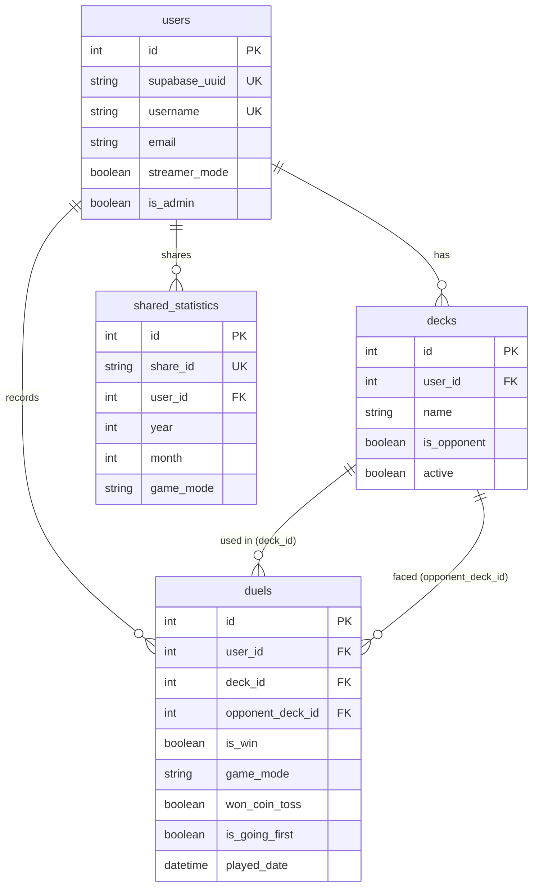

# データベーススキーマ

PostgreSQL (Supabase)上のテーブル定義。

---

## ER図

---

## テーブル一覧

| テーブル | 説明 |
|---------|------|
| `users` | ユーザー情報 |
| `decks` | デッキ情報（自分/相手） |
| `duels` | 対戦履歴 |
| `shared_statistics` | 統計共有設定 |
| `sharedurls` | 共有URL（レガシー） |
| `password_reset_tokens` | パスワードリセット |

---

## users テーブル

| カラム | 型 | 制約 | 説明 |
|--------|-----|------|------|
| `id` | Integer | PK | ユーザーID |
| `supabase_uuid` | String(36) | UK, Nullable | Supabase AuthのUUID |
| `username` | String | UK, Not Null | ユーザー名 |
| `email` | String | UK, Nullable | メールアドレス |
| `streamer_mode` | Boolean | Default: false | 配信者モード |
| `theme_preference` | String | Default: 'dark' | テーマ設定 |
| `is_admin` | Boolean | Default: false | 管理者権限 |
| `status` | String(20) | Default: 'active' | アカウント状態 |

---

## decks テーブル

| カラム | 型 | 制約 | 説明 |
|--------|-----|------|------|
| `id` | Integer | PK | デッキID |
| `user_id` | Integer | FK (users) | ユーザーID |
| `name` | String | Not Null | デッキ名 |
| `is_opponent` | Boolean | Default: false | 相手デッキフラグ |
| `active` | Boolean | Default: true | アクティブフラグ |

---

## duels テーブル

| カラム | 型 | 制約 | 説明 |
|--------|-----|------|------|
| `id` | Integer | PK | 対戦ID |
| `user_id` | Integer | FK (users) | ユーザーID |
| `deck_id` | Integer | FK (decks) | 自分のデッキ |
| `opponent_deck_id` | Integer | FK (decks) | 相手のデッキ |
| `is_win` | Boolean | Not Null | 勝利=true |
| `game_mode` | String(10) | Default: 'RANK' | RANK/RATE/EVENT/DC |
| `rank` | Integer | Nullable | ランク (1-15) |
| `rate_value` | Float | Nullable | レート値 |
| `dc_value` | Integer | Nullable | DC値 |
| `won_coin_toss` | Boolean | Not Null | コイントス勝利=true |
| `is_going_first` | Boolean | Not Null | 先攻=true |
| `played_date` | DateTime | Not Null | 対戦日時 (UTC) |
| `notes` | String | Nullable | メモ |

> **命名規則の移行:** `result`→`is_win`, `coin`→`won_coin_toss`, `first_or_second`→`is_going_first`

---

## shared_statistics テーブル

| カラム | 型 | 制約 | 説明 |
|--------|-----|------|------|
| `id` | Integer | PK | 共有統計ID |
| `share_id` | String | UK, Not Null | 共有ID (URLに使用) |
| `user_id` | Integer | FK (users) | ユーザーID |
| `year` | Integer | Not Null | 対象年 |
| `month` | Integer | Not Null | 対象月 |
| `game_mode` | String(10) | Not Null | ゲームモード |
| `expires_at` | DateTime | Nullable | 有効期限 |

---

## 関連ドキュメント

| ドキュメント | 内容 |
|------------|------|
| @../02-architecture/backend-architecture.md | バックエンド構造 |
| @../06-interfaces/api-reference.md | API仕様 |
