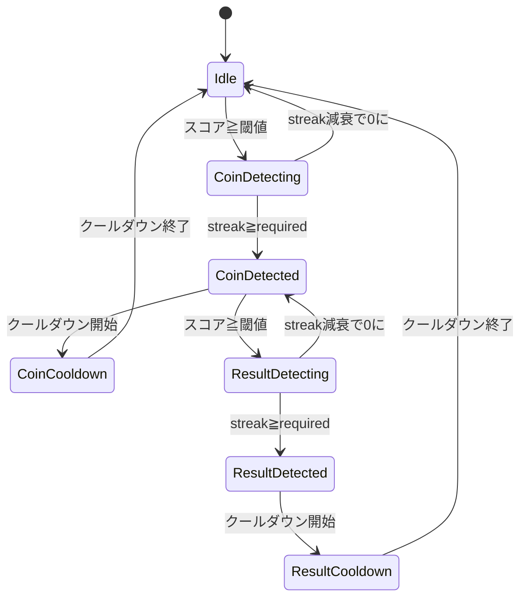

# 画面解析FSM設計書

画面解析機能のFSM（有限状態機械）設計。TensorFlow.js一本化とアーキテクチャ改善。

---

## 概要

| 項目 | 内容 |
|------|------|
| 目的 | コイントス・勝敗検出のFSMをWorkerから分離し、テスト・デバッグを容易にする |
| 検出手法 | TensorFlow.js（MLモデル）に一本化、Template方式を削除 |
| 状態管理 | メインスレッドでFSMを管理、Vue DevToolsでリアルタイム確認可能 |

---

## 現状の問題点

| 問題 | 詳細 | 影響 |
|------|------|------|
| コード重複 | Template/TFJSで同じFSMを2回実装 | 保守性低下 |
| FSM隠蔽 | Worker内部に状態があり、UIからデバッグ困難 | 開発効率低下 |
| streak即リセット | 候補変更で`streak = 0`、ノイズ1フレームで全リセット | 検出不安定 |
| エラー通知なし | フレーム解析エラーがログのみでUI通知なし | ユーザー体験低下 |

---

## FSM状態設計

### 状態遷移図



### 状態定義

| 状態 | 説明 | 遷移条件 |
|------|------|---------|
| `Idle` | 待機中、検出なし | コインスコア≧閾値で`CoinDetecting`へ |
| `CoinDetecting` | コイントス検出中（streak蓄積中） | streak減衰で0→`Idle`、streak≧required→`CoinDetected` |
| `CoinDetected` | コイントス確定、勝敗検出可能 | クールダウン開始→`CoinCooldown`、勝敗スコア≧閾値→`ResultDetecting` |
| `CoinCooldown` | コイントス検出後のクールダウン | 時間経過→`Idle` |
| `ResultDetecting` | 勝敗検出中（streak蓄積中） | streak減衰で0→`CoinDetected`、streak≧required→`ResultDetected` |
| `ResultDetected` | 勝敗確定 | クールダウン開始→`ResultCooldown` |
| `ResultCooldown` | 勝敗検出後のクールダウン | 時間経過→`Idle` |

### 状態データ構造

```typescript
interface FSMState {
  phase: DetectionPhase;
  // コイントス検出
  coinStreak: number;
  coinCandidate: 'win' | 'lose' | null;
  coinActiveUntil: number;
  coinCooldownUntil: number;
  // 勝敗検出
  resultStreak: number;
  resultCandidate: 'win' | 'lose' | null;
  resultCooldownUntil: number;
  resultLocked: boolean;
  // イベントID（UI連携用）
  coinEventId: number;
  resultEventId: number;
}

type DetectionPhase =
  | 'idle'
  | 'coinDetecting'
  | 'coinDetected'
  | 'coinCooldown'
  | 'resultDetecting'
  | 'resultDetected'
  | 'resultCooldown';
```

---

## streak減衰ロジック

### 改善方針

| 現状 | 改善 |
|------|------|
| 候補変更で即`streak = 0` | 減衰方式で「ノイズ1フレームで全リセット」を防止 |
| スコア閾値未満で即`streak = 0` | 緩やかに減衰（-0.5/フレーム） |

### アルゴリズム

```typescript
function updateStreak(
  currentStreak: number,
  score: number,
  threshold: number,
  candidate: string | null,
  newCandidate: string,
): number {
  // 1. スコアが閾値未満 → 緩やかに減衰
  if (score < threshold) {
    return Math.max(0, currentStreak - 0.5);
  }

  // 2. 候補が変わった → 大きく減衰（ただしリセットではない）
  if (candidate && candidate !== newCandidate) {
    return Math.max(0, currentStreak - 1.5);
  }

  // 3. 同じ候補で閾値以上 → 増加
  return currentStreak + 1;
}
```

### 減衰値設定

| 条件 | 減衰値 | 理由 |
|------|--------|------|
| スコア閾値未満 | -0.5 | 一時的なノイズを許容 |
| 候補変更 | -1.5 | 明確な変化には反応、ただし即リセットは回避 |
| 同じ候補で閾値以上 | +1.0 | 連続検出でstreak増加 |

---

## コイントス→勝敗の連携

### シーケンス

```
[初期状態: resultLocked = true]

1. コイントス検出 (streak≧5)
   ↓
2. resultLocked = false に設定 ← ここで初めて勝敗検出可能に
   coinActiveUntil = now + 20秒
   coinCooldownUntil = now + 15秒
   ↓
3. 勝敗検出が可能に（resultLockedがfalseの間）
   ↓
4. 勝敗検出 (streak≧3)
   ↓
5. resultLocked = true に設定
   resultCooldownUntil = now + 12秒
   ↓
6. 次のコイントス検出まで勝敗検出はブロック
```

### ロック状態の意味

| 状態 | resultLocked | 説明 |
|------|--------------|------|
| 初期 | `true` | 起動直後の勝敗画面による誤検出を防止 |
| コイントス検出後 | `false` | 勝敗検出が可能 |
| 勝敗検出後 | `true` | 次のコイントス検出まで勝敗検出をブロック |

---

## 新アーキテクチャ

### ファイル構成

```
frontend/src/
├── composables/
│   └── useScreenAnalysis.ts      # 統合Composable + FSM（メインスレッド）
├── workers/
│   └── screenAnalysis.worker.ts  # ML分類のみ（FSMなし、リネーム予定）
└── utils/
    └── screenAnalysis/
        ├── config.ts             # 統合設定
        ├── fsm.ts                # FSM状態機械
        └── types.ts              # 型定義
```

### データフロー

```
[画面キャプチャ] → [メインスレッド] → [Worker]
                        ↑                 ↓
                     FSM処理          ML分類のみ
                        ↓                 ↓
                  [検出イベント] ← [スコア返却]
```

### メッセージ形式

**メインスレッド → Worker:**
```typescript
interface AnalyzeMessage {
  type: 'analyze';
  imageData: ImageData;
  timestamp: number;
}
```

**Worker → メインスレッド:**
```typescript
interface ScoresMessage {
  type: 'scores';
  scores: {
    coinWin: number;
    coinLose: number;
    resultWin: number;
    resultLose: number;
    coinLabel: string;
    resultLabel: string;
  };
  timestamp: number;
}
```

---

## 設定パラメータ

| パラメータ | 値 | 説明 |
|-----------|-----|------|
| `coin.requiredStreak` | 5 | コイントス確定に必要な連続検出数 |
| `coin.cooldownMs` | 15000 | コイントス検出後のクールダウン |
| `coin.activeMs` | 20000 | コイントス検出後の有効期間 |
| `result.requiredStreak` | 3 | 勝敗確定に必要な連続検出数 |
| `result.cooldownMs` | 12000 | 勝敗検出後のクールダウン |
| `streak.decayOnLowScore` | 0.5 | スコア閾値未満時の減衰値 |
| `streak.decayOnCandidateChange` | 1.5 | 候補変更時の減衰値 |

---

## 削除対象

| ファイル | 理由 |
|---------|------|
| `composables/useScreenCaptureAnalysis.ts` | Template方式の廃止 |
| `workers/screenAnalysis.worker.ts` | 旧Template版Worker |
| `utils/screenAnalysis.ts`（一部） | テンプレートマッチング関連関数 |

---

## テスト戦略

### 単体テスト（Vitest）

| 対象 | テスト内容 |
|------|-----------|
| `fsm.ts` | streak減衰ロジック |
| `fsm.ts` | 状態遷移（Idle→CoinDetecting→CoinDetected等） |
| `fsm.ts` | エッジケース（クールダウン中の検出、ロック状態） |

### 手動テスト

| 対象 | テスト内容 |
|------|-----------|
| 画面解析全体 | 実際のゲーム画面でコイントス検出 |
| 画面解析全体 | 勝敗検出 |
| 画面解析全体 | 連続対戦時の状態リセット |

---

## デバッグ機能

### デバッガー専用UI

デバッグ・学習データ収集機能は`is_debugger`フラグを持つユーザーのみ表示。

| UI要素 | デバッガー | 通常ユーザー |
|--------|----------|------------|
| 開始/停止ボタン | ✅ | ✅ |
| ステータス表示 | ✅ | ✅ |
| スコア表示 | ✅ | ❌ |
| 画像保存ボタン | ✅ | ❌ |
| FSM状態表示 | ✅ | ❌ |

### Vue DevTools連携

```typescript
// FSM状態をreactiveで公開
return {
  fsmState: readonly(state),  // DevToolsで確認可能
};
```

---

## 関連ドキュメント

| ドキュメント | 内容 |
|------------|------|
| @./screen-recording-analysis.md | 画面録画分析の全体設計 |
| @../02-architecture/frontend-architecture.md | フロントエンド構造 |
