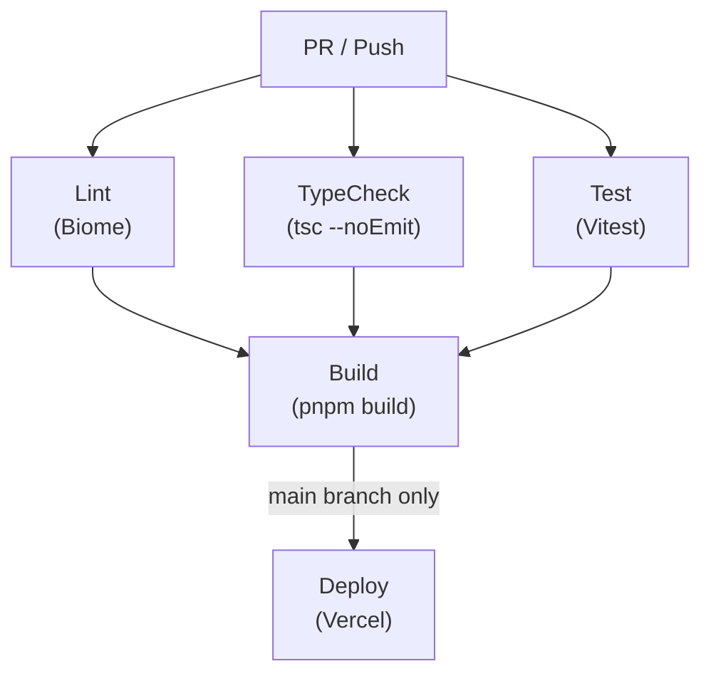

# CI/CD設定

> Status: Active
> 最終更新: 2026-01-23

GitHub ActionsによるCI/CDパイプライン

---

## 概要

| 項目 | 内容 |
|------|------|
| 目的 | CI/CD設定のSSoT |
| 対象読者 | 開発者 |
| 設定ファイル | `.github/workflows/` |

> [!NOTE]
> 実際のワークフロー定義は `.github/workflows/` 配下のYAMLファイルがSSoTです。

---

## パイプライン概要

---

## ワークフロー一覧

### CI Workflow（`.github/workflows/ci.yml`）

| ジョブ | 実行コマンド | 説明 |
|-------|-------------|------|
| lint | `pnpm lint` | ESLintチェック |
| typecheck | `pnpm typecheck` | 型チェック |
| test | `pnpm test:coverage` | テスト + カバレッジ |
| build | `pnpm build` | ビルド（lint/typecheck/test成功後） |

### トリガー条件

| イベント | ブランチ | 説明 |
|---------|---------|------|
| push | main, develop | プッシュ時に実行 |
| pull_request | main, develop | PR作成/更新時に実行 |

### E2E Workflow（`.github/workflows/e2e.yml`）

| ジョブ | 実行コマンド | 説明 |
|-------|-------------|------|
| e2e | `pnpm test:e2e` | Playwright E2Eテスト |

失敗時は`playwright-report/`をアーティファクトとしてアップロード。

---

## Vercel統合

### 自動デプロイ

Vercel GitHub統合により自動デプロイ:

| ブランチ | デプロイ先 |
|---------|-----------|
| `main` | Production |
| `develop` | Preview |
| `feature/*` | Preview |

---

## 環境変数管理

### GitHub Secrets

| Secret | 用途 |
|--------|------|
| `CODECOV_TOKEN` | カバレッジレポート |
| `VERCEL_TOKEN` | Vercel CLI認証（手動デプロイ時） |

設定場所: `Settings → Secrets and variables → Actions`

### Vercel環境変数

Vercel Dashboardで管理。GitHub Secretsとは別管理。

---

## ブランチ保護ルール

### mainブランチ

| 設定 | 値 |
|------|-----|
| Require status checks | ✅ |
| Required checks | lint, typecheck, test, build |
| Require PR reviews | ✅ |
| Dismiss stale reviews | ✅ |

### developブランチ

| 設定 | 値 |
|------|-----|
| Require status checks | ✅ |
| Required checks | lint, typecheck, test |

設定場所: `Settings → Branches → Branch protection rules`

---

## 依存関係更新

### Dependabot

設定ファイル: `.github/dependabot.yml`

| 設定項目 | 値 |
|---------|-----|
| package-ecosystem | npm |
| schedule | weekly |
| commit-message prefix | `chore(deps):` |

---

## カバレッジ要件

| 対象 | 最小カバレッジ |
|------|---------------|
| 全体 | 80% |
| サービス層 | 90% |
| フック | 80% |

### Codecov設定

設定ファイル: `codecov.yml`

| 設定 | 値 |
|------|-----|
| project target | 80% |
| patch target | 80% |

---

## 手動ワークフロー実行

### workflow_dispatch

`Actions` タブから手動実行可能:

| 入力 | オプション |
|------|----------|
| environment | preview, production |

---

## 関連ドキュメント

| ドキュメント | 内容 |
|------------|------|
| [コントリビューションガイド](../07-development/contributing.md) | コントリビューションガイド |
| [テストガイド](../05-guides/testing.md) | テストガイド |
| [Vercel設定](./vercel.md) | Vercel設定 |
