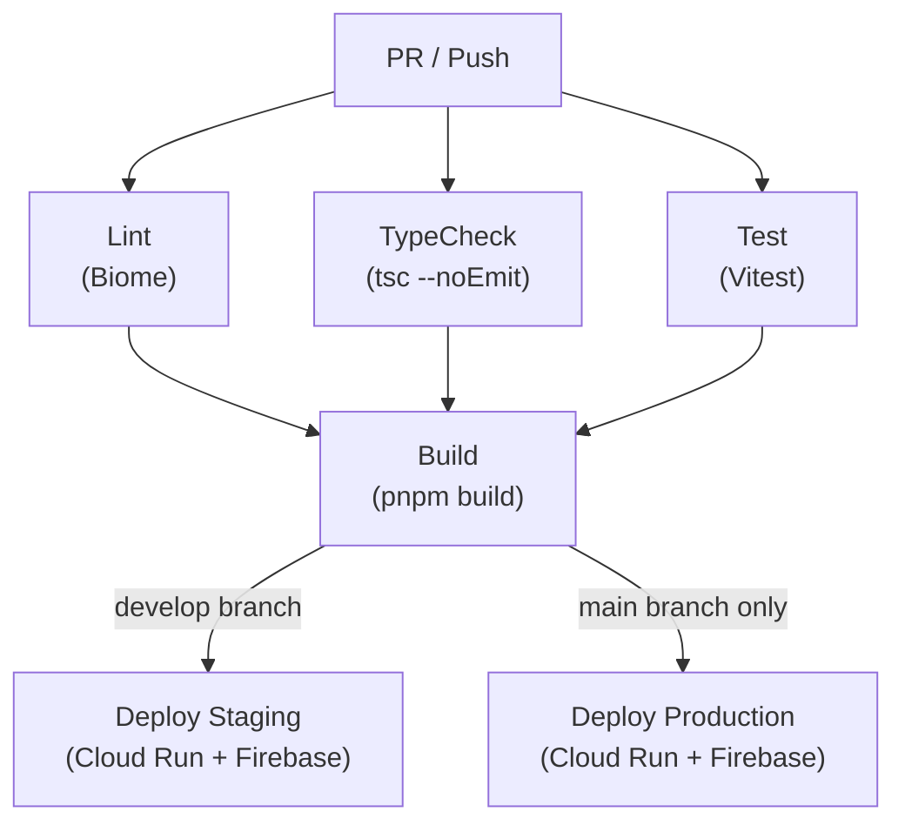

# CI/CD設定

> Status: Active
> 最終更新: 2026-03-19

GitHub ActionsによるCI/CDパイプライン

---

## 概要

| 項目 | 内容 |
|------|------|
| 目的 | CI/CD設定のSSoT |
| 対象読者 | 開発者 |
| 設定ファイル | `.github/workflows/` |

> [!NOTE]
> 実際のワークフロー定義は `.github/workflows/` 配下のYAMLファイルがSSoTです。

---

## パイプライン概要

```mermaid
flowchart TD
    trigger["PR / Push"] --> lint["Lint<br/>(Biome)"]
    trigger --> typecheck["TypeCheck<br/>(tsc --noEmit)"]
    trigger --> test["Test<br/>(Vitest)"]
    lint --> build["Build<br/>(pnpm build)"]
    typecheck --> build
    test --> build
    build -->|develop branch| staging["Deploy Staging<br/>(Cloud Run + Firebase)"]
    build -->|main branch only| deploy["Deploy Production<br/>(Cloud Run + Firebase)"]
```

---

## ワークフロー一覧

### CI Workflow（`.github/workflows/ci.yml`）

| ジョブ | 実行コマンド | 説明 |
|-------|-------------|------|
| lint | `pnpm lint` | ESLintチェック |
| typecheck | `pnpm typecheck` | 型チェック |
| test | `pnpm test:coverage` | テスト + カバレッジ |
| build | `pnpm build` | ビルド（lint/typecheck/test成功後） |

### トリガー条件

| イベント | ブランチ | 説明 |
|---------|---------|------|
| push | main, develop | プッシュ時に実行 |
| pull_request | main, develop | PR作成/更新時に実行 |

### Deploy jobs（`.github/workflows/ci.yml`）

| ジョブ | 実行条件 | デプロイ先 |
|-------|----------|-----------|
| `deploy-staging` | `develop` push / manual | Firebase Hosting `duel-log-staging` + Cloud Run `duel-log-api-staging` |
| `deploy-production` | `main` push / manual | Firebase Hosting `duel-log` + Cloud Run `duel-log-api` |

| ブランチ | 役割 | URL |
|---------|------|-----|
| `develop` | staging | `https://duel-log-staging.web.app` |
| `main` | production | `https://duel-log.codenica.dev` |

---

## 環境変数管理

### GitHub Secrets

| Secret | 用途 |
|--------|------|
| `CODECOV_TOKEN` | カバレッジレポート |
| `SUPABASE_ACCESS_TOKEN` | production migration |
| `SUPABASE_PROJECT_REF` | production migration |
| `DUEL_LOG_PRODUCTION_ENV_FILE` | production 用 app / API env |
| `DUEL_LOG_STAGING_ENV_FILE` | staging 用 app / API env |

設定場所: `Settings → Secrets and variables → Actions`

### GitHub Variables

| Variable | 用途 |
|---------|------|
| `GOOGLE_CLOUD_PROJECT` | GCP project id |
| `GOOGLE_CLOUD_REGION` | Cloud Run region |
| `GCP_WORKLOAD_IDENTITY_PROVIDER` | GitHub OIDC provider |
| `GCP_SERVICE_ACCOUNT` | deploy service account |
| `ARTIFACT_REGISTRY_REPOSITORY` | Docker image repo |
| `FIREBASE_HOSTING_SITE` | production Hosting site |
| `CLOUD_RUN_SERVICE` | production API service |
| `STAGING_FIREBASE_HOSTING_SITE` | staging Hosting site |
| `STAGING_CLOUD_RUN_SERVICE` | staging API service |

---

## ブランチ保護ルール

### mainブランチ

| 設定 | 値 |
|------|-----|
| Require status checks | ✅ |
| Required checks | lint, typecheck, test, build |
| Require PR reviews | ✅ |
| Dismiss stale reviews | ✅ |

### developブランチ

| 設定 | 値 |
|------|-----|
| Require status checks | ✅ |
| Required checks | lint, typecheck, test |

設定場所: `Settings → Branches → Branch protection rules`

---

## 依存関係更新

### Dependabot

設定ファイル: `.github/dependabot.yml`

| 設定項目 | 値 |
|---------|-----|
| package-ecosystem | npm |
| schedule | weekly |
| commit-message prefix | `chore(deps):` |

---

## カバレッジ要件

| 対象 | 最小カバレッジ |
|------|---------------|
| 全体 | 80% |
| サービス層 | 90% |
| フック | 80% |

### Codecov設定

設定ファイル: `codecov.yml`

| 設定 | 値 |
|------|-----|
| project target | 80% |
| patch target | 80% |

---

## 手動ワークフロー実行

### workflow_dispatch

`Actions` タブから手動実行可能:

| 入力 | オプション |
|------|----------|
| environment | GitHub UI から branch を選んで実行 |

---

## 関連ドキュメント

| ドキュメント | 内容 |
|------------|------|
| [コントリビューションガイド](../07-development/contributing.md) | コントリビューションガイド |
| [テストガイド](../05-guides/testing.md) | テストガイド |
| [Staging環境](./staging.md) | Google staging 運用 |
