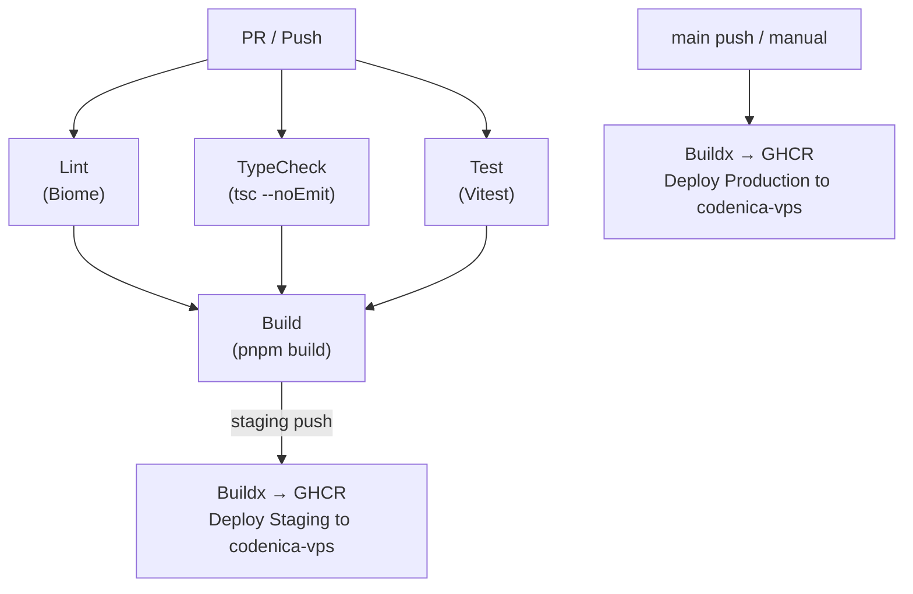

# CI/CD設定

> Status: Active
> 最終更新: 2026-07-14

GitHub ActionsによるCI/CDパイプライン

---

## 概要

| 項目 | 内容 |
|------|------|
| 目的 | CI/CD設定のSSoT |
| 対象読者 | 開発者 |
| 設定ファイル | `.github/workflows/` |

> [!NOTE]
> 実際のワークフロー定義は `.github/workflows/` 配下のYAMLファイルがSSoTです。

---

## パイプライン概要

```mermaid
flowchart TD
    trigger["PR / Push"] --> lint["Lint<br/>(Biome)"]
    trigger --> typecheck["TypeCheck<br/>(tsc --noEmit)"]
    trigger --> test["Test<br/>(Vitest)"]
    lint --> build["Build<br/>(pnpm build)"]
    typecheck --> build
    test --> build
    build -->|staging push| staging["Buildx → GHCR<br/>Deploy Staging to codenica-vps"]
    main["main push / manual"] --> production["Buildx → GHCR<br/>Deploy Production to codenica-vps"]
```

---

## ワークフロー一覧

### CI Workflow（`.github/workflows/ci.yml`）

| ジョブ | 実行コマンド | 説明 |
|-------|-------------|------|
| check | `pnpm lint`, `pnpm typecheck` | Biomeチェック + 型チェック |
| test | `pnpm test` | テスト |
| build | `pnpm build` | ビルド（lint/typecheck成功後、testとは並列） |

### トリガー条件

| イベント | ブランチ | 説明 |
|---------|---------|------|
| push | main, staging | プッシュ時に実行 |
| pull_request | main, staging | PR作成/更新時に実行 |

### Deploy jobs

| Workflow / job | 実行条件 | デプロイ先 |
|----------------|----------|-----------|
| `.github/workflows/ci.yml` / `deploy-staging` | `staging` push / manual | codenica-vps staging (static frontend + API Compose) |
| `.github/workflows/deploy.yml` / `deploy` | `main` push / manual | codenica-vps production (static frontend + API Compose) |

両環境とも、GitHub Actions の Buildx で API image をビルドして `ghcr.io/krtw00/duel-log-api` へpushする。VPS上のComposeはBuildxが返したdigestを含むimage referenceへ更新し、そのdigestで起動したことを確認する。

| ブランチ | 役割 | Public URL | Public health |
|---------|------|------------|---------------|
| `staging` | staging | `https://duel-log-staging.codenica.dev` | `https://duel-log-staging.codenica.dev/api/health` |
| `main` | production | `https://duel-log.codenica.dev` | `https://duel-log.codenica.dev/api/health` |

デプロイ後はVPS内で `/api/health` と `/api/health/db` を確認する。stagingではさらに login → `path=/` のCSRF cookie読取 → mutation → logout の実機smokeを実行する。

---

## 環境変数管理

### GitHub Secrets

| Secret | 用途 |
|--------|------|
| `VPS_SSH_KEY` | codenica-vpsへのfrontend/APIデプロイ |
| `DUEL_LOG_STAGING_ENV_FILE` | staging frontend build env |
| `STAGING_SMOKE_EMAIL` / `STAGING_SMOKE_PASSWORD` | staging認証smoke（未設定時はskip） |
| `GITHUB_TOKEN` | GHCRへのimage pushと、デプロイ時の一時的なpull認証 |

設定場所: `Settings → Secrets and variables → Actions`

### GitHub Variables

| Variable | 用途 |
|---------|------|
| `VPS_HOST` | codenica-vps host |
| `VPS_USER` | codenica-vps deploy user |

### API secretの境界

APIのDB接続情報等はVPS既存の暗号化ファイル（production: `/opt/duel-log-api/secrets.enc.env`、staging: `/opt/duel-log-api-staging/secrets.enc.env`）をCompose起動時に利用する。CIはsecret値を取得・表示・ローカルコピーせず、Composeのimage reference更新、pull、起動だけを行う。GHCR認証も一時的なDocker設定ディレクトリを使い、処理終了時に削除する。

---

## ブランチ保護ルール

### mainブランチ

| 設定 | 値 |
|------|-----|
| Require status checks | ✅ |
| Required checks | lint, typecheck, test, build |
| Require PR reviews | ✅ |
| Dismiss stale reviews | ✅ |

### stagingブランチ

| 設定 | 値 |
|------|-----|
| Require status checks | ✅ |
| Required checks | lint, typecheck, test |

設定場所: `Settings → Branches → Branch protection rules`

---

## 依存関係更新

### Dependabot

設定ファイル: `.github/dependabot.yml`

| 設定項目 | 値 |
|---------|-----|
| package-ecosystem | npm |
| schedule | weekly |
| commit-message prefix | `chore(deps):` |

---

## カバレッジ要件

| 対象 | 最小カバレッジ |
|------|---------------|
| 全体 | 80% |
| サービス層 | 90% |
| フック | 80% |

### Codecov設定

設定ファイル: `codecov.yml`

| 設定 | 値 |
|------|-----|
| project target | 80% |
| patch target | 80% |

---

## 手動ワークフロー実行

### workflow_dispatch

`Actions` タブから手動実行可能:

GitHub UIで対象workflowとbranchを選んで実行する。workflow固有の入力項目はない。

---

## 関連ドキュメント

| ドキュメント | 内容 |
|------------|------|
| [コントリビューションガイド](../07-development/contributing.md) | コントリビューションガイド |
| [テストガイド](../05-guides/testing.md) | テストガイド |
| [Staging環境](./staging.md) | codenica-vps staging 運用 |
