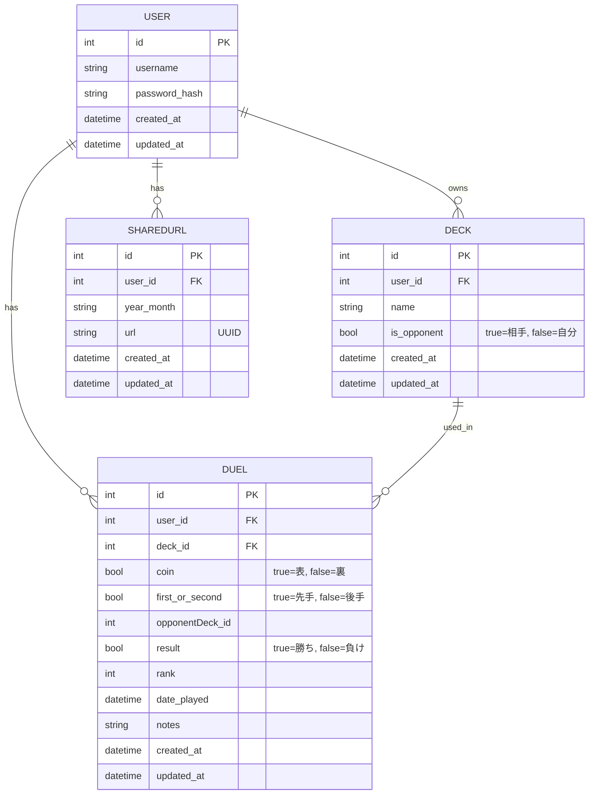

```mermaid
erDiagram
    USER ||--o{ DECK : owns
    USER ||--o{ DUEL : has
    USER ||--o{ SHAREDURL : has

    DECK ||--o{ DUEL : used_in

    USER {
        int id PK
        string username
        string password_hash
        datetime created_at
        datetime updated_at
    }

    DECK {
        int id PK
        int user_id FK
        string name
        bool is_opponent        "true=相手, false=自分"
        datetime created_at
        datetime updated_at
    }

    DUEL {
        int id PK
        int user_id FK
        int deck_id FK
        bool coin             "true=表, false=裏"
        bool first_or_second  "true=先手, false=後手"
        int opponentDeck_id
        bool result           "true=勝ち, false=負け"
        int rank
        datetime date_played
        string notes
        datetime created_at
        datetime updated_at
    }

    SHAREDURL {
        int id PK
        int user_id FK
        string year_month
        string url            "UUID"
        datetime created_at
        datetime updated_at
    }

```
